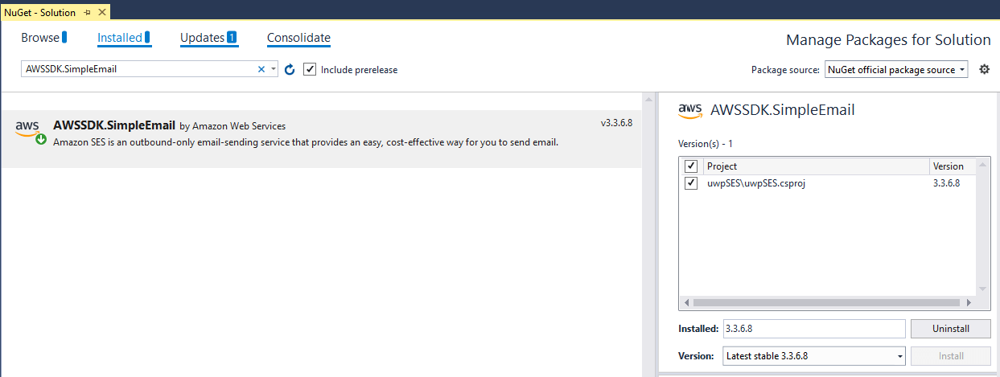

# Simple Email Service

**Amazon SES** is an email service that provides you with a way to send and receive emails using your own email addresses and domains.

This article will demonstrate how one can use this service from a UWP application and send an email to a specific address.

## Step 1: Create the UWP Application

Create a standard UWP application and add a [RadDataForm]() element to it. We are also going to add a button element which will be responsible for sending the email.

#### __[XAML] Example 1: Defining the view__

	<Page
	    x:Class="UWPemailService.MainPage"
	    xmlns="http://schemas.microsoft.com/winfx/2006/xaml/presentation"
	    xmlns:x="http://schemas.microsoft.com/winfx/2006/xaml"
	    xmlns:local="using:UWPemailService"
	    xmlns:d="http://schemas.microsoft.com/expression/blend/2008"
	    xmlns:mc="http://schemas.openxmlformats.org/markup-compatibility/2006"
	    xmlns:data="using:Telerik.UI.Xaml.Controls.Data"
	    mc:Ignorable="d"
	    Background="{ThemeResource ApplicationPageBackgroundThemeBrush}">
	    <Grid>
	        <Grid.RowDefinitions>
	            <RowDefinition/>
	            <RowDefinition Height="100"/>
	        </Grid.RowDefinitions>
	        <data:RadDataForm Item="{Binding Form}" 
	                          x:Name="dataForm"
	                          Grid.Row="0"/>
	        <Button Grid.Row="1" 
	                Background="Red"
	                Foreground="Black"
	                HorizontalAlignment="Stretch"
	                Command="{Binding SendEmailCommand}"
	                Content="Send Message"/>
	    </Grid>
	</Page>

## Step 2: Add the SES assemblies

Open the NuGet Package Manager and install the **AWSSDK Simple Email** package.

## Step 3: Define the ViewModel

The Next step is to create the ViewModel. It will need an [IAmazonSimpleEmailService](https://docs.aws.amazon.com/sdkfornet/v3/apidocs/items/SimpleEmail/TISimpleEmailService.html) instance which will be used for sending the emails. We also need to implement the command that the Button is bound to.

#### __[C#] Example 2: Defining the ViewModel__

    public class ViewModel
    {
        public Form Form { get; set; }
        public ViewModel()
        {
            this.SendEmailCommand = new Command(() => OnSendEmail(null));
            this.Form = new Form();
        }
        public Command SendEmailCommand { get; set; }

        private async void OnSendEmail(object obj)
        {
            using (var client = new AmazonSimpleEmailServiceClient("your awsAccessKeyId", "your awsSecretAccessKey", RegionEndpoint.USEast1))
            {
                var sendRequest = new SendEmailRequest
                {
                    Source = Form.FromEmail,
                    Destination = new Destination { ToAddresses = new List<string> { Form.ToEmail } },
                    Message = new Message
                    {
                        Subject = new Content(Form.Subject),
                        Body = new Body { Text = new Content(Form.Content) }
                    }
                };
                try
                {
                    Debug.WriteLine("Sending email using AWS SES...");
                    var response = await client.SendEmailAsync(sendRequest);
                    Debug.WriteLine("The email was sent successfully.");
                }
                catch (Exception ex)
                {
                    Debug.WriteLine("The email was not sent.");
                    Debug.WriteLine("Error message: " + ex.Message);
                }
            }
        }
    }

Make sure to also set this **ViewModel** class as a **DataContext** of the **RadDataForm**:

	 	public MainPage()
        {
            this.InitializeComponent();
            this.DataContext = new ViewModel();
        }

Here is how the **Form** class is defined:

	public class Form : ViewModelBase
    {
        private string fromEmail;
        private string toEmail;
        private string subject;
        private string content;

        [Display(Header = "From Email address:")]
        public string FromEmail
        {
            get { return this.fromEmail; }
            set
            {
                this.fromEmail = value;
                this.OnPropertyChanged();
            }
        }

        [Display(Header = "To Email address:")]
        public string ToEmail
        {
            get { return this.toEmail; }
            set
            {
                toEmail = value;
                this.OnPropertyChanged();
            }
        }

        [Display(Header = "Subject")]
        public string Subject
        {
            get { return this.subject; }
            set
            {
                this.subject = value;
                this.OnPropertyChanged();
            }
        }

        [Display(Header = "Content")]
        public string Content
        {
            get { return this.content; }
            set
            {
                this.content = value;
                this.OnPropertyChanged();
            }
        }
    }

> The attributes used to mark the properties are part of the **Telerik.Data.Core** assembly

And here is the implementation of the Command class:

	public class Command : ICommand
    {
        private Action _action;

        public Command(Action action)
        {
            this._action = action;
        }

        public event EventHandler CanExecuteChanged;
        public bool CanExecute(object parameter)
        {
            return true;
        }

        public void RaiseCanExecuteChanged()
        {
            this.CanExecuteChanged?.Invoke(this, EventArgs.Empty);
        }

        public virtual void Execute(object parameter)
        {
            this._action();
        }
    }

#### Figure 1: Appearance of the application

## Step 4: Add verified email addresses

Before using the application you must verify some email addresses. If you are using the test environment both sender and receiver addresses must be verified. This should be done from the AWS console. You can read the [Verifying an Email Address Using the Amazon SES Console](https://docs.aws.amazon.com/ses/latest/DeveloperGuide/verify-email-addresses-procedure.html#verify-email-addresses-procedure-console) article in order to learn how to do that.

> Please note that the addresses are verified for each region and the regions in the console and the application must be the same. 

After the addresses are added you are ready to test your application. 

# See Also

* [Simple Email Service - Overview](https://docs.aws.amazon.com/ses/latest/DeveloperGuide/Welcome.html)
* [DynamoDB]()