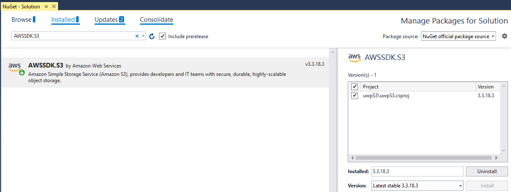
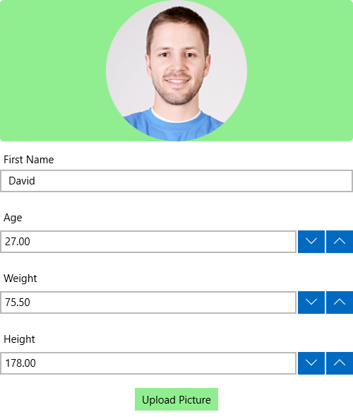

# Storage (S3) 

The **Amazon Simple Storage Service** (Amazon S3) is a storage service that allows you to upload any kind of data at any time, from anywhere. This article will demonstrate how one can use this service from a UWP application. More specifically, the example shows how to upload an image from the device's library to the **Amazon S3 Storage** client. 

## Step 1: Create the XAML layout

We are going to use the [RadDataForm]() control from the **Telerik UI for UWP** suite in order to create the layout which will be a simple view regarding a user of our application.

#### **[XAML] Example 1: Defining the view**

	<Page
	    x:Class="uwpS3.MainPage"
	    xmlns="http://schemas.microsoft.com/winfx/2006/xaml/presentation"
	    xmlns:x="http://schemas.microsoft.com/winfx/2006/xaml"
	    xmlns:local="using:uwpS3"
	    xmlns:d="http://schemas.microsoft.com/expression/blend/2008"
	    xmlns:mc="http://schemas.openxmlformats.org/markup-compatibility/2006"
	    xmlns:data="using:Telerik.UI.Xaml.Controls.Data"
	    mc:Ignorable="d"
	    Background="{ThemeResource ApplicationPageBackgroundThemeBrush}">
	
	    <Grid>
	        <Grid.DataContext>
	            <local:ViewModel/>
	        </Grid.DataContext>
	        <Grid.RowDefinitions>
	            <RowDefinition Height="200"/>
	            <RowDefinition />
	            <RowDefinition Height="50"/>
	        </Grid.RowDefinitions>
	
	        <Border Background="LightGreen" 
	                CornerRadius="5">
	            <Image Source="{Binding User.ImageSource}" 
	               x:Name="userImage"/>
	        </Border>
	        <data:RadDataForm x:Name="dataForm" 
	                          Item="{Binding User}"
	                          Grid.Row="1"/>
	        <Button x:Name="upload_button" 
	                Click="upload_button_Click"
	                Content="Upload Picture" 
	                Background="LightGreen"
	                HorizontalAlignment="Center"
	                Grid.Row="2"/>
	    </Grid>
	</Page>

## Step 2: Install the NuGet package

Open the NuGet Package Manager and install the **AWSSDK.S3** package.

> If you do not have an AWS account in Visual Studio, please check the [Getting Started]() article.

## Step 3: Create a new bucket

Before proceeding with the example you will have to create a new bucket using the AWS Management Console. You can learn how to do that in the [Creating a Bucket](https://docs.aws.amazon.com/AmazonS3/latest/gsg/CreatingABucket.html) article.

## Step 4: Define the ViewModel

The next step is to create the ViewModel. It will need an [IAmazonS3](https://docs.aws.amazon.com/sdkfornet/latest/apidocs/items/TS3IS3NET45.html) client object which will be used for managing the data. 

#### __[C#] Example 2: Defining the ViewModel__

    public class ViewModel : ViewModelBase
    {
        private User user;
        public User User
        {
            get { return this.user; }
            set
            {
                this.user = value;
                this.OnPropertyChanged();
            }
        }

        public ViewModel()
        {
            this.User = new User();
        }
    }

And here is how the **User** class is defined:

#### __[C#] Example 3: Defining the User business object__

	public class User : ViewModelBase
    {
        string name = "David";
        double weight = 75.5;
        int height = 178;
        int age = 27;
        private string imageSource = "Assets/user_image.png";

        [Ignore]
        public string ImageSource
        {
            get
            {
                return this.imageSource;
            }
            set
            {
                this.imageSource = value;
                OnPropertyChanged();
            }
        }

        [Display(Header = "First Name")]
        public string Name
        {
            get { return this.name; }
            set
            {
                if (value != this.name)
                {
                    this.name = value;
                    OnPropertyChanged();
                }
            }
        }

        [Display(Header = "Age")]
        public int Age
        {
            get { return this.age; }
            set
            {
                if (value != this.age)
                {
                    this.age = value;
                    OnPropertyChanged();
                }
            }
        }
        [Display(Header = "Weight")]
        public double Weight
        {
            get { return this.weight; }
            set
            {
                if (value != this.weight)
                {
                    this.weight = value;
                    OnPropertyChanged();
                }
            }
        }

        [Display(Header = "Height")]
        public int Height
        {
            get { return this.height; }
            set
            {
                if (value != this.height)
                {
                    this.height = value;
                    OnPropertyChanged();
                }
            }
        }
    }

> The attributes used to mark the properties are part of the Telerik.Data.Core assembly

Here is how the page looks at this point:

Now that we have defined the **User** model and the **ViewModel** for our application, let's proceed with setting up the connection to the **S3 Service**. Here is how to do this in the code-behind of the page:

		public TransferUtility s3transferUtility;
        IAmazonS3 s3client;

        public MainPage()
        {
            this.InitializeComponent();
            setupAWSCredentials();
        }

        public void setupAWSCredentials()
        {
            this.s3client = new AmazonS3Client("your awsAccessKeyId", "your awsSecretKeyId", RegionEndpoint.USEast1);
            var config = new AmazonS3Config() { RegionEndpoint = Amazon.RegionEndpoint.USEast1, Timeout = TimeSpan.FromSeconds(30), UseHttp = true };

            AWSConfigsS3.UseSignatureVersion4 = true;
            this.s3transferUtility = new TransferUtility(s3client);
        } 

We are going to set the following logic in the event handler of the **Button** in order to add the functionality to change the profile picture of the User and upload this picture to the S3 storage:

		private async void upload_button_Click(object sender, RoutedEventArgs e)
        {
            FileOpenPicker fileOpenPicker = new FileOpenPicker();
            fileOpenPicker.SuggestedStartLocation = PickerLocationId.PicturesLibrary;
            fileOpenPicker.FileTypeFilter.Add(".png");
            fileOpenPicker.ViewMode = PickerViewMode.Thumbnail;
            
            var inputFile = await fileOpenPicker.PickSingleFileAsync();
            
            if (inputFile == null)
            {
                return;
            }

            try
            {
                var streamToUpload = await inputFile.OpenStreamForReadAsync();
                await this.s3transferUtility.UploadAsync(
                        streamToUpload,
                        "justmybucket",
                        "Profile-pic").ContinueWith(((x) =>
                        {
                            Debug.WriteLine("Image Uploaded");
                        }));
            }
            catch (Exception)
            {
                throw;
            }
            IRandomAccessStream stream = await inputFile.OpenAsync(FileAccessMode.Read);
            BitmapImage bitmapImage = new BitmapImage();
            await bitmapImage.SetSourceAsync(stream);
            this.userImage.Source = bitmapImage;
        }

Clicking on the button will allow you to choose another picture from the device's storage which is  set as the picture of the user and uploaded to the bucket you have previously created. 

# See Also

* [DynamoDB]()
* [Getting started with Amazon S3 Storage](https://aws.amazon.com/s3/getting-started/)
* [Working with Amazon S3 Buckets](https://docs.aws.amazon.com/AmazonS3/latest/dev/UsingBucket.html)