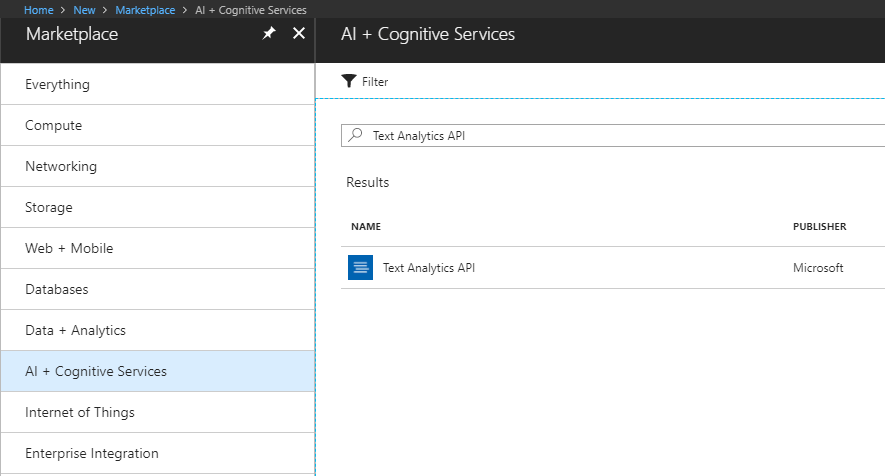
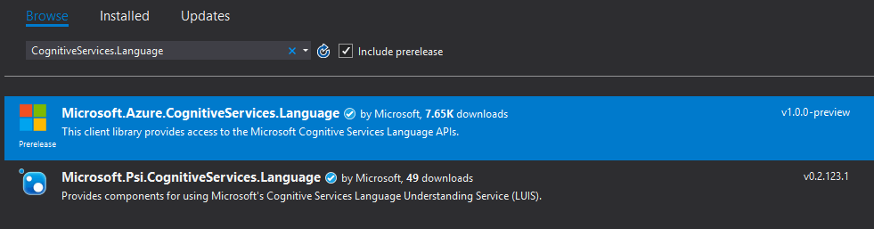
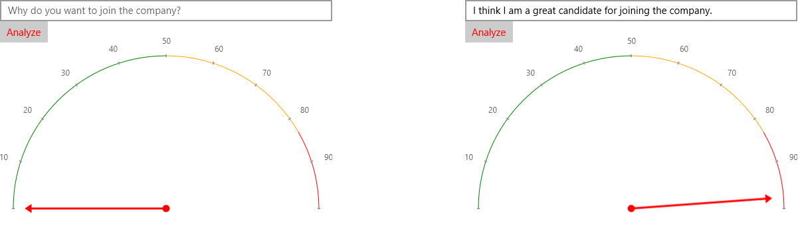

# Text Analysis

This article will guide you through the process of integrating Azure's [Text Analytics API](https://azure.microsoft.com/en-us/services/cognitive-services/text-analytics/) with the controls from the **Telerik UI for UWP** suite. More specifically, we are going to use the **RadRadialGauge** control within a page which can be used to determine whether the text which is entered is in English or not as well as analyze its sentiment. The more positive the input message is - the closer the result will be to 100 on the Gauge scale. 

## Create a Text Analytics API Account

Before you start, you need to create a new **Text Analytics API** account through the Azure portal. This has been explained in great detail in [this article](https://docs.microsoft.com/en-us/azure/cognitive-services/cognitive-services-apis-create-account).

Once you've created the account, you have to obtain the subscription keys that have been generated for you. You will require them later on in order to make API calls from your application.

## Create the Application

Once you have activated the Text Analytics service, you can proceed with creating a new UWP application. We are going to use the following page for the purposes of the example:

	<Page
         x:Class="UWPcognitiveAzure.MainPage"
         xmlns="http://schemas.microsoft.com/winfx/2006/xaml/presentation"
         xmlns:x="http://schemas.microsoft.com/winfx/2006/xaml"
         xmlns:local="using:UWPcognitiveAzure"
         xmlns:d="http://schemas.microsoft.com/expression/blend/2008"
         xmlns:mc="http://schemas.openxmlformats.org/markup-compatibility/2006"
         xmlns:dataViz="using:Telerik.UI.Xaml.Controls.DataVisualization"
         mc:Ignorable="d">

           <StackPanel Background="{ThemeResource ApplicationPageBackgroundThemeBrush}">
               <TextBox x:Name="entry"
                        PlaceholderText="Why do you want to join the company?"/>
               <Button Content="Analyze"
                       Foreground="Red"
                       Click="btn_Click"
                       BorderThickness="2"
                       x:Name="btn"/>
               <dataViz:RadRadialGauge Margin="20" 
                                       LabelRadiusScale="1.1" 
                                       Grid.Row="1">
                   <dataViz:ArrowGaugeIndicator Brush="Red" 
                                                Thickness="3" 
                                                ArrowTailRadius="2" 
                                                Value="{Binding Confidence}" 
                                                Margin="20"/>
                   <dataViz:SegmentedRadialGaugeIndicator Value="100">
                       <dataViz:BarIndicatorSegment Stroke="Green" Length="3"/>
                       <dataViz:BarIndicatorSegment Stroke="Orange" Length="2" />
                       <dataViz:BarIndicatorSegment Stroke="Red" Length="1" />
                   </dataViz:SegmentedRadialGaugeIndicator>
               </dataViz:RadRadialGauge>
           </StackPanel>
	</Page>

## Add the Microsoft.Azure.CognitiveServices.Language NuGet Package

You can now add the **Microsoft.Azure.CognitiveServices.Language** NuGet package which provides access to the Microsoft Cognitive Services Language APIs.

## Using the Text Analytics API

The following code snippet shows the code-behind of the previously created page where the Text Analytics API is used:

	public sealed partial class MainPage : Page, INotifyPropertyChanged
    {
        const string subscriptionKey = "eb30ab448b214c94b9a472f65346551c";
        private ITextAnalyticsAPI client;
        public MainPage()
        {
            this.InitializeComponent();
            this.DataContext = this;

            client = new TextAnalyticsAPI();
            client.AzureRegion = AzureRegions.Eastus2;
            client.SubscriptionKey = subscriptionKey;
        }

        private double confidence;
        public double Confidence
        {
            get { return confidence; }
            set
            {
                this.confidence = value;
                this.NotifyPropertyChanged();
            }
        }

        private async Task<double?> MakeAnalysisRequest(string text)
        {
            LanguageBatchResult languageResult = await client.DetectLanguageAsync(
                    new BatchInput(
                        new List<Input>()
                        {
                            new Input("1", text)
                        }));

            var language = languageResult.Documents.First().DetectedLanguages.First();

            SentimentBatchResult sentimentResult = await client.SentimentAsync(
                new MultiLanguageBatchInput(new List<MultiLanguageInput>()
                {
                    new MultiLanguageInput(language.Iso6391Name, "1", text)
                }));

            var sentiment = sentimentResult.Documents.First();

            return (language.Score + sentiment.Score) / 2;
        }

        private async void btn_Click(object sender, RoutedEventArgs e)
        {
            var result = await MakeAnalysisRequest(entry.Text);
            this.Confidence = (double)(result * 100);
        }
      
        public event PropertyChangedEventHandler PropertyChanged;
        private void NotifyPropertyChanged([CallerMemberName] String propertyName = "")
        {
            if (PropertyChanged != null)
            {
                PropertyChanged(this, new PropertyChangedEventArgs(propertyName));
            }
        }
    }

Running the application and typing something positive in English should give you a confidence level close to 100. Here is  the actual result:

## See Also
