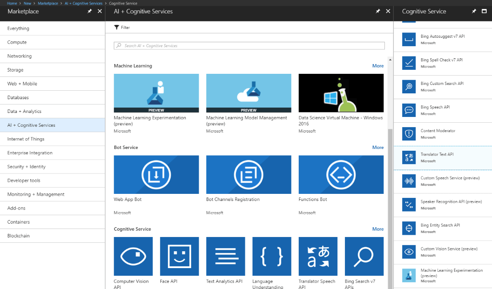
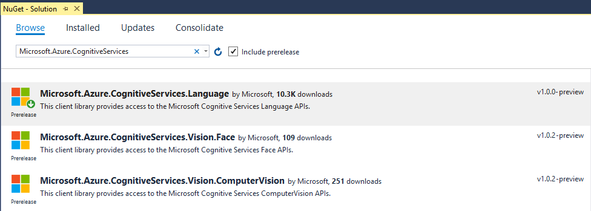
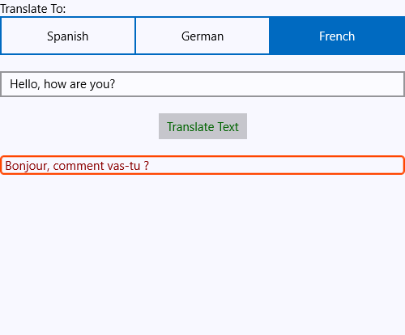

# Text Translation 

This article will guide you through the process of integrating Azure's [Translator Text API](https://docs.microsoft.com/en-us/azure/cognitive-services/translator/) with the controls from the **Telerik UI for UWP** suite.

## Create a Translator Text API Account

Before you start, you need to create a new Translation Text API account through the Azure portal. This has been explained in great detail in [this article](https://docs.microsoft.com/en-us/azure/cognitive-services/cognitive-services-apis-create-account).

Once you've created the account, you have to obtain the subscription keys that have been generated for you. You will require them later on in order to make API calls from your application.

## Create the Application

Once we have activated the service, we can proceed with creating a simple UWP application. We are going to use the following view in order to utilize the translation service:

	<Page
	    x:Class="UWPtranslationAPI.MainPage"
	    xmlns="http://schemas.microsoft.com/winfx/2006/xaml/presentation"
	    xmlns:x="http://schemas.microsoft.com/winfx/2006/xaml"
	    xmlns:local="using:UWPtranslationAPI"
	    xmlns:d="http://schemas.microsoft.com/expression/blend/2008"
	    xmlns:mc="http://schemas.openxmlformats.org/markup-compatibility/2006"
	    xmlns:telerikInput="using:Telerik.UI.Xaml.Controls.Input"
	    mc:Ignorable="d">

    	<StackPanel Background="GhostWhite">
        	<StackPanel>
            	<TextBlock Text="Translate To:"/>
            	<telerikInput:RadSegmentedControl x:Name="segmentedControl" 
                                              ItemsSource="{Binding Languages}"/>
        	</StackPanel>
        	<StackPanel Margin="0,20,0,0">
            	<TextBox PlaceholderText="Type in something in English..." 
                     	x:Name="entry"/>
            	<Button x:Name="btn"
	                    Margin="0,20,0,0"
	                    Content="Translate Text"
	                    Foreground="DarkGreen"
	                    HorizontalAlignment="Center"
	                    Click="Button_Click"/>
            	<Border BorderBrush="OrangeRed"
	                    Margin="0,20,0,0"
	                    BorderThickness="2" 
	                    CornerRadius="3.2" 
	                    VerticalAlignment="Top">
                	<TextBlock x:Name="resultLabel"
                       		   Foreground="DarkRed"/>
            	</Border>
        	</StackPanel>
    	</StackPanel>
	</Page>

## Add the Azure Language NuGet Package

You now have to add the **Microsoft.Azure.CognitiveServices.Language** NuGet package.

## Use the Text Translation API

Now that we have set up the application and have created the required UI, we need to send a REST request to the Text Translation API. It should include the text(extracted from the **TextBox**) and the language in which the text should be translated(chosen through the **RadSegmented** control):

	public sealed partial class MainPage : Page
    {
        public List<string> Languages { get; set; }

        static string key = "your unique key";
        static string host = "https://api.microsofttranslator.com";
        static string path = "/V2/Http.svc/Translate";
        public MainPage()
        {
            this.Languages = new List<string>()  {"Spanish", "German", "French" };
            this.InitializeComponent();
            this.DataContext = this;
        }

        private async void Button_Click(object sender, RoutedEventArgs e)
        {
            TranslateTextAsync(this.resultLabel);
        }

        public async void TranslateTextAsync(TextBlock label)
        {
            HttpClient client = new HttpClient();
            client.DefaultRequestHeaders.Add("Ocp-Apim-Subscription-Key", key);

            string translateToLanguage = (this.segmentedControl.ItemsSource as List<string>)[this.segmentedControl.SelectedIndex];
            string textToTranslate = this.entry.Text;

            string languageCode = CheckLanguageCode(translateToLanguage);

            if (!translateToLanguage.Equals(String.Empty))
            {
                string uri = host + path + "?to=" + languageCode + "&text=" + System.Net.WebUtility.UrlEncode(textToTranslate);
                HttpResponseMessage response = await client.GetAsync(uri);
                string result = await response.Content.ReadAsStringAsync();
                var content = XElement.Parse(result).Value;
                label.Text = " " + content;
            }
        }

        private string CheckLanguageCode(string translateToLanguage)
        {
            switch (translateToLanguage)
            {
                case "Spanish":
                    return "es-es";
                case "French":
                    return "fr-fr";
                case "German":
                    return "de-de";
                default:
                    return "en-en";
            }
        }
    }	

Now that you have everything set correctly, try typing something in English and chose the language to which it will be translated from the **RadSegmented** control's options. Here is the appearance of the view once you have used the translation service:

## See Also
* [Text Analysis]()
* [Blob Storage]()
