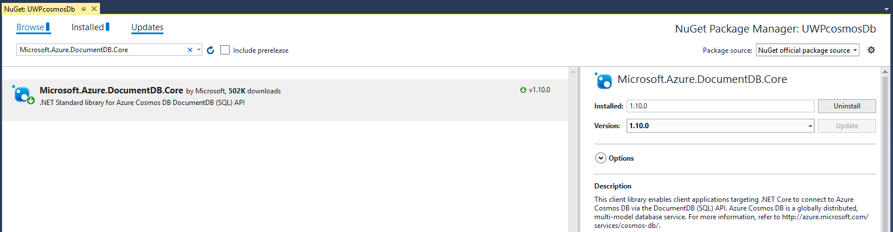
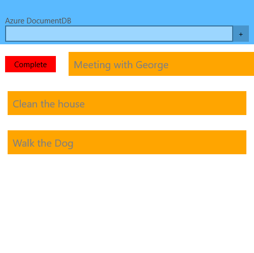
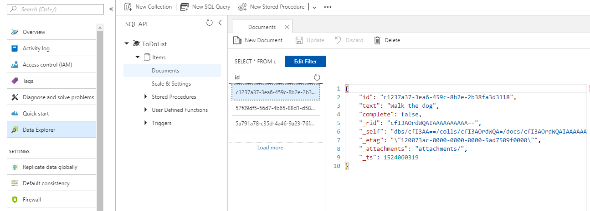
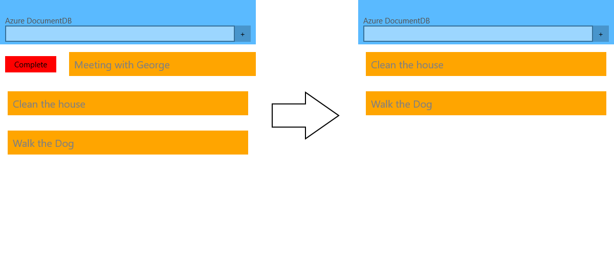
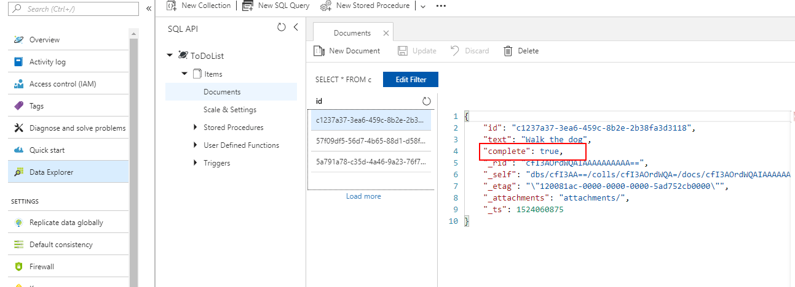

# Integration between Cosmos DB and RadListView

**Azure Cosmos DB** is a globally distributed, multi-model database service which enables you to develop document, key-value, wide-column, and graph databases by using popular APIs and programming models. This article will show you how to integrate the RadGridView control to work with your remote database.

## Set Up the Database

Let's start with setting up the Cosmos Db database. Microsoft Azure's documentation is pretty detailed and shows how to achieve this step-by-step. You can review the following  guide in order to set up your database - [Create a database account](https://docs.microsoft.com/en-us/azure/cosmos-db/create-sql-api-dotnet#create-a-database-account)

## Create the Demo Application

Once you have successfully created the database account, you can proceed with setting up the demo application.

> You should also [Add a collection](https://docs.microsoft.com/en-us/azure/cosmos-db/create-sql-api-dotnet#add-a-collection) which is again explained in details in the step-by-step guide. 

As a first step, install the **Microsoft.Azure.DocumentDB.Core** NuGet package within the project

We are going to add a collection of Todo items and manage them in our UWP application. Let's first create the **TodoItem** model:

	public class TodoItem
    {
        [JsonProperty(PropertyName = "id")]
        public string Id { get; set; }

        [JsonProperty(PropertyName = "text")]
        public string Text { get; set; }

        [JsonProperty(PropertyName = "complete")]
        public bool Complete { get; set; }
    }

> You should install the NewtonSoft.Json NuGet Package 

We are also going to create a **TodoItemManager** class which will be responsible for communicating with Azure. Here is how it is defined.

	public partial class TodoItemManager
    {
        static TodoItemManager defaultInstance = new TodoItemManager();

        const string accountURL = @"URI(can be found in the Overview tab in Azure)";
        const string accountKey = @"your account key";
        const string databaseId = @"ToDoList";
        const string collectionId = @"Items";

        private Uri collectionLink = UriFactory.CreateDocumentCollectionUri(databaseId, collectionId);

        private DocumentClient client;

        private TodoItemManager()
        {
            client = new DocumentClient(new System.Uri(accountURL), accountKey);
        }

        public static TodoItemManager DefaultManager
        {
            get
            {
                return defaultInstance;
            }
            private set
            {
                defaultInstance = value;
            }
        }
        public List<TodoItem> Items { get; private set; }

        public async Task<List<TodoItem>> GetTodoItemsAsync()
        {
            try
            {
                // The query excludes completed TodoItems
                var query = client.CreateDocumentQuery<TodoItem>(collectionLink, new FeedOptions { MaxItemCount = -1 })
                      .Where(todoItem => todoItem.Complete == false)
                      .AsDocumentQuery();

                Items = new List<TodoItem>();
                while (query.HasMoreResults)
                {
                    Items.AddRange(await query.ExecuteNextAsync<TodoItem>());
                }
            }
            catch (Exception e)
            {
                Console.Error.WriteLine(@"ERROR {0}", e.Message);
                return null;
            }
            return Items;
        }

        public async Task<TodoItem> InsertItemAsync(TodoItem todoItem)
        {
            try
            {
                var result = await client.CreateDocumentAsync(collectionLink, todoItem);
                todoItem.Id = result.Resource.Id;
                Items.Add(todoItem);
            }
            catch (Exception e)
            {
                Console.Error.WriteLine(@"ERROR {0}", e.Message);
            }
            return todoItem;
        }

        public async Task CompleteItemAsync(TodoItem item)
        {
            try
            {
                item.Complete = true;
                await client.ReplaceDocumentAsync(UriFactory.CreateDocumentUri(databaseId, collectionId, item.Id), item);

                Items.Remove(item);

            }
            catch (Exception e)
            {
                Console.Error.WriteLine(@"ERROR {0}", e.Message);
            }
        }
    }

> Both the TodoItem and TodoManager classes can be found when you download a sample project directly from Azure's CosmosDb QuickStart page.

Here is the XAML definition of the page which we are going to use:

	<Page x:Class="UWPcosmosDb.MainPage"
		  xmlns="http://schemas.microsoft.com/winfx/2006/xaml/presentation"
		  xmlns:x="http://schemas.microsoft.com/winfx/2006/xaml"
		  xmlns:local="using:UWPcosmosDb"
		  xmlns:d="http://schemas.microsoft.com/expression/blend/2008"
		  xmlns:mc="http://schemas.openxmlformats.org/markup-compatibility/2006"
		  xmlns:telerikDataControls="using:Telerik.UI.Xaml.Controls.Data"
		  mc:Ignorable="d">
    <Grid Background="{ThemeResource ApplicationPageBackgroundThemeBrush}">
        <Grid.RowDefinitions>
            <RowDefinition Height="Auto" />
            <RowDefinition Height="*" />
        </Grid.RowDefinitions>
        <StackPanel Grid.Row="0" Background="#5ABAFF" Padding="10,30,10,5">
            <TextBlock Foreground="#555555" Text="Azure DocumentDB" />
            <Grid>
                <Grid.ColumnDefinitions>
                    <ColumnDefinition/>
                    <ColumnDefinition Width="Auto"/>
                </Grid.ColumnDefinitions>
                <TextBox x:Name="newItemName"/>
                <StackPanel x:Name="buttonsPanel" Grid.Column="1" Orientation="Horizontal">
                    <Button Content="+"
                             MinHeight="30"
                             Click="OnAdd" />
                </StackPanel>
            </Grid>
        </StackPanel>
        <telerikDataControls:RadListView x:Name="todoList"
                                         IsActionOnSwipeEnabled="True"
                                         ItemSwipeOffset="120, 0, 0, 0"
                                         ItemSwipeThreshold="120"
                                         SelectionMode="None"
                                         Grid.Row="1">
            <telerikDataControls:RadListView.SwipeActionContent>
                <Grid Margin="0"
                          Padding="0"
                          ColumnSpacing="0"
                          RowSpacing="0">
                    <Grid.ColumnDefinitions>
                        <ColumnDefinition Width="120" />
                        <ColumnDefinition Width="*" />
                    </Grid.ColumnDefinitions>
                    <Button Margin="0"
                            Background="Red"
                            Click="OnComplete"
                            Content="Complete"
                            Width="100"/>
                </Grid>
            </telerikDataControls:RadListView.SwipeActionContent>

            <telerikDataControls:RadListView.ItemTemplate>
                <DataTemplate>
                    <Grid Background="Orange">
                        <TextBlock Margin="10" Text="{Binding Text}" Foreground="Gray" />
                    </Grid>
                </DataTemplate>
            </telerikDataControls:RadListView.ItemTemplate>
        </telerikDataControls:RadListView>
    </Grid>
</Page>

The newItemName **TextBox** is used for choosing a name for the item which we are going to add. By clicking the **Button** we are going to add this item to our database. Here is the code-behind of the page where we are using the methods introduced in the TodoItemManager class:

		TodoItemManager manager;
        public MainPage()
        {
            this.InitializeComponent();
            manager = TodoItemManager.DefaultManager;
            RefreshItems();
        }

        private async Task RefreshItems()
        {
             todoList.ItemsSource = await manager.GetTodoItemsAsync();
        }
        private async void OnAdd(object sender, RoutedEventArgs e)
        {
            var todo = new TodoItem { Text = newItemName.Text };
            await AddItem(todo);
            newItemName.Text = string.Empty;
        }

        async Task AddItem(TodoItem item)
        {
            await manager.InsertItemAsync(item);
            todoList.ItemsSource = await manager.GetTodoItemsAsync();
        }

        private async void OnComplete(object sender, RoutedEventArgs e)
        {
            var btn = ((Button)sender);
            var todo = btn.DataContext as TodoItem;
            await CompleteItem(todo);
        }

        async Task CompleteItem(TodoItem item)
        {
            item.Complete = true;
            await manager.CompleteItemAsync(item);
            todoList.ItemsSource = await manager.GetTodoItemsAsync();
        }

Here is the appearance of the **RadListView** after we have added several items in our database:

If you have a look at the Data Explorer in Azure's portal, you will notice that the items are correctly added:

We have defined the **RadListView** so that an item is marked as complete by clicking the button within its custom Swipe ItemTemplate:

After the updates, you can notice that the individual item marked as complete is updated as well:

## See Also

* [SQL Database]()
* [Azure Blob Storage]()
