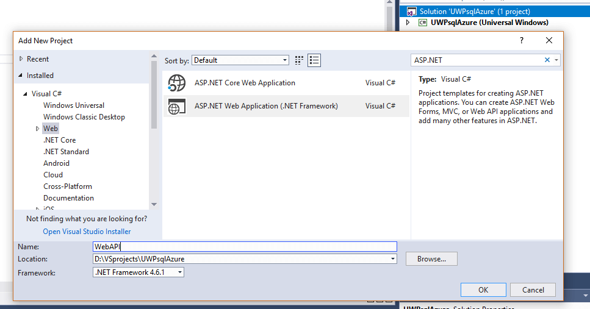
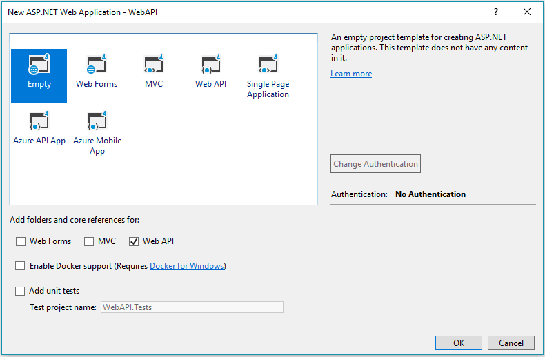
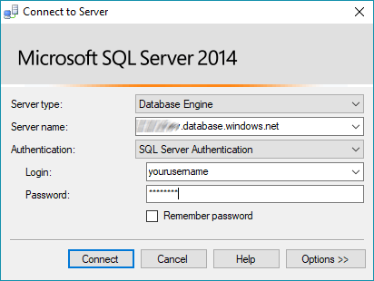
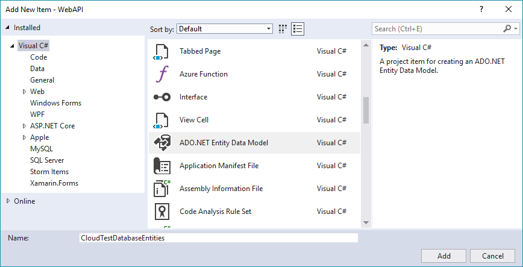
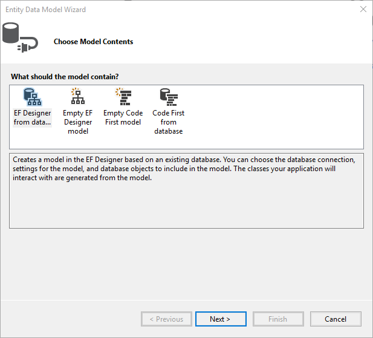
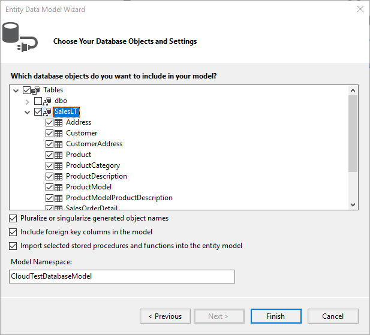
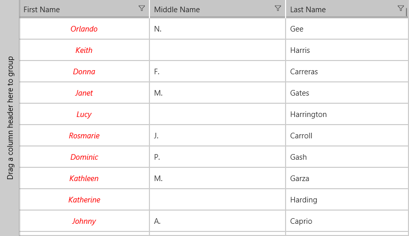

# RadDataGrid with Azure SQL Database 

This article demonstrates how to integrate an Azure's [SQL Database](https://azure.microsoft.com/en-us/services/sql-database/) and display the data using the [RadDataGrid](). 

## Set up the Database

You can set up the sample database by following the [Create an Azure SQL database in the Azure portal](https://docs.microsoft.com/en-us/azure/sql-database/sql-database-get-started-portal#create-a-sql-database) step-by-step guide.

## Create the application

We are going to use a **ASP.NET Web API project** in combination with our **UWP** project. In the web application, through **EntityFramework**'s built-in functionalities we are going to connect to the **Azure SQL Database** and create our models. Eventually, we are going to expose a specific table and consume it by making a REST request  within our UWP application.

You can take the following steps to add a web project to your solution:

**1.** Add new project to the solution and choose ASP.NET Web Application:

**2.** Choose Empty project template and the "Web API" option from the references list:

**3.** If you want, you can set up your **SQL Server Management Studio** so that it connects to the Azure database as well. 

## Reverse-engineer the Database Using Entity Framework

**1.** Add a new item to your WEB Api project and choose **ADO.NET Entity Data Model** from the list of available items.

**2.** Give it a suitable name and click **Add**. We are going to use **CloudTestDatabaseEntities** for the test sample.

**3.** Choose **EF Designer from database** from the **Choose Model Contents** dialog.

**4.** Click on **New Connection...** and input the server name and credentials which you can obtain from the Azure portal. Choose the **SQL Server Authentication** option to log on to the server.

**5.** Choose whether or not to include the sensitive data in the connection string, choose a name for it and click **Next**.

**6.** Pick the database object you wish to include and click **Finish**.

You are now able to work with the entities you have chosen through the created **DbContext** - **CloudTestDatabaseEntities** in our case.

## Expose the Data

In order to expose some of the data from our database, we are going to create a new controller in the web project.
Right-click the Controllers folder, and add new empty "Web API 2 Controller". Name your controller and add a method that returns the data you would like to expose. For example:

	public class CustomersController : ApiController
    {
        public ObservableCollection<Customer> GetCustomers()
        {
            var viewmodel = new CustomersViewModel();
            var customers = viewmodel.Customers;
            return customers;
        }
    }

Where the **CustomersViewModel** is as follows:

	public class CustomersViewModel
    {
        public ObservableCollection<Customer> Customers { get; set; } = new ObservableCollection<Customer>();
        CloudTestDatabaseEntities dbContext = new CloudTestDatabaseEntities();
        public CustomersViewModel()
        {
            this.Customers = PopulateCustomers();
        }

        private ObservableCollection<Customer> PopulateCustomers()
        {
            ObservableCollection<Customer> customers = new ObservableCollection<Customer>();

            foreach (Customer customer in dbContext.Customers)
            {
                customers.Add(customer);
            }
            return customers;
        }
    }

You can now get this information through querying the server on which the web application is deployed. For the purposes of this example, the application is hosted locally.

## Consume the Data in the UWP application

We are going to use the **HttpClient** class from the **System.Net.Http** namespace in order make our HTTP query and consume the data.

You can create a class that will hold static information such as the server address, username and password if required, etc.

	class Constants
    {
        public static string RestUrl = "http://localhost:51248/api/";
    }

Here is the actual RestService class which is responsible for requesting the information and storing it in the memory of our application:

    class RestService : IRestService
    {
        HttpClient client;
        public ObservableCollection<Customer> Customers { get; set; }

        public async Task<ObservableCollection<Customer>> GetCustomersAsync()
        {
            Customers = new ObservableCollection<Customer>();
            client = new HttpClient();
            client.BaseAddress = new Uri(Constants.RestUrl);

            try
            {
                var response = await client.GetAsync("Customers");
                if (response.IsSuccessStatusCode)
                {
                    var content = await response.Content.ReadAsStringAsync();
                    Customers = JsonConvert.DeserializeObject<ObservableCollection<Customer>>(content);
                }
            }
            catch (Exception ex)
            {
                Debug.WriteLine(@"ERROR {0}", ex.Message);
            }

            return Customers;
        }
    }

Where the **IRestService** interface is defined as:

	public interface IRestService
    {
        Task<ObservableCollection<Customer>> GetCustomersAsync();
    }

This **RestService** is used within a **CustomersManager** class:

	public class CustomersManager
    {
        IRestService restService;
        public CustomersManager(IRestService service)
        {
            restService = service;
        }

        public Task<ObservableCollection<Customer>> GetCustomersAsync()
        {
            return restService.GetCustomersAsync();
        }
    }

And the Customer class used within the Xamarin.Forms application:

	public class Customer
    {
        public string FirstName { get; set; }
        public string LastName { get; set; }
        public string EmailAddress { get; set; }
    }

So all is left in order to obtain the collection of customers is to instantiate the manager and set the information it provides as the **ItemsSource** of the **RadDataGrid** control defined in our application:

	public static CustomersManager CustomersManager { get; private set; }
    public App()
    {
        // The root page of your application
        MainPage = new StartPage();
        CustomersManager = new CustomersManager(new RestService());
    }

And in the code-behind of the page that contains the **RadListView** control:
	
     public MainPage()
	     {
	         this.InitializeComponent();
	         PopulateListViewAsync();
	     }

	 private async void PopulateListViewAsync()
        {
            var items = await App.CustomersManager.GetCustomersAsync();
            (this.listView as RadListView).ItemsSource = items;
        }

Here is how the **RadListView** is defined as well:

	<Page
	    x:Class="UWPsqlAzure.MainPage"
	    xmlns="http://schemas.microsoft.com/winfx/2006/xaml/presentation"
	    xmlns:x="http://schemas.microsoft.com/winfx/2006/xaml"
	    xmlns:local="using:UWPsqlAzure"
	    xmlns:d="http://schemas.microsoft.com/expression/blend/2008"
	    xmlns:mc="http://schemas.openxmlformats.org/markup-compatibility/2006"
	    xmlns:telerikGrid="using:Telerik.UI.Xaml.Controls.Grid"
	    mc:Ignorable="d">

	    <Grid Background="{ThemeResource ApplicationPageBackgroundThemeBrush}">
	        <telerikGrid:RadDataGrid x:Name="DataGrid" 
	                                 AutoGenerateColumns="False">
	            <telerikGrid:RadDataGrid.Columns>
	                <telerikGrid:DataGridTextColumn PropertyName="FirstName" Header="First Name">
	                    <telerikGrid:DataGridTextColumn.CellContentStyle>
	                        
	                    </telerikGrid:DataGridTextColumn.CellContentStyle>
	                </telerikGrid:DataGridTextColumn>
	                <telerikGrid:DataGridTextColumn PropertyName="MiddleName" Header="Middle Name"/>
	                <telerikGrid:DataGridTextColumn PropertyName="LastName" Header="Last Name"/>
	            </telerikGrid:RadDataGrid.Columns>
	        </telerikGrid:RadDataGrid>
	    </Grid>
	</Page>

Here is the appearance of the **RadDataGrid** control when you run the UWP application:

## See Also

* [Azure Cosmos DB]()
* [Azure Blob Storage]()
