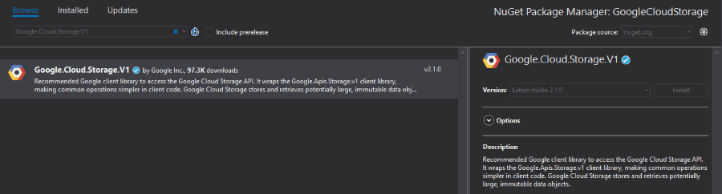
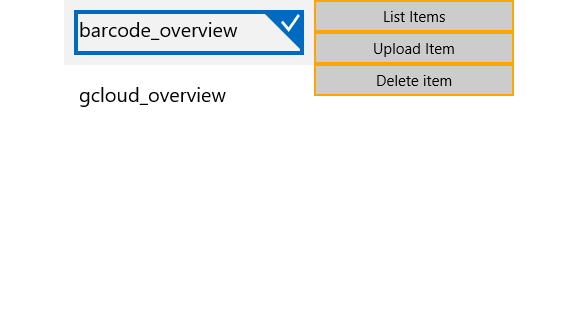

# Cloud Storage

Google Cloud Storage allows world-wide storage and retrieval of any amount of data at any time. It can be used for a range of scenarios including serving website content, storing data for archival and disaster recovery, or distributing large data objects to users via direct download.

## Enable APIs

For the purposes of this article, you will have to enable the Google Cloud Storage API and Google Cloud Storage JSON API. Please read the [Getting Started]() for more information on how you can achieve that.

## Step 1: Create the {{ site.framework_name }} Application

Create a standard {{ site.framework_name }} application and add 3 Buttons and a RadListView control to it. The first button will list all of the files uploaded in our storage. The second button will upload a file and the third one will delete the selected file in the RadListView.

#### __[XAML] Example 1: Defining the view__

    <Grid>
        <Grid.ColumnDefinitions>
            <ColumnDefinition Width="*" />
            <ColumnDefinition Width="200"/>
        </Grid.ColumnDefinitions>

        <data:RadListView x:Name="radListView" 
                          Grid.Column="0"
                          ItemsSource="{Binding FileNames}" 
                          SelectedItem="{Binding SelectedItem, Mode=TwoWay}" />
        <Grid Grid.Column="1">
            <Grid.RowDefinitions>
                <RowDefinition Height="Auto" />
                <RowDefinition Height="Auto"/>
                <RowDefinition Height="Auto"/>
            </Grid.RowDefinitions>

            <Button HorizontalAlignment="Stretch"
                    BorderBrush="Orange"
                    Content="List Items" 
                    Command="{Binding ListItemsCommand}"/>
            
            <Button Content="Upload Item" 
                    BorderBrush="Orange"
                    HorizontalAlignment="Stretch"
                    Command="{Binding UploadItemCommand}"  
                    Grid.Row="1"/>
            
            <Button Content="Delete item" 
                    BorderBrush="Orange"
                    HorizontalAlignment="Stretch"
                    Command="{Binding DeleteItemCommand}" 
                    Grid.Row="2"/>
        </Grid>
    </Grid>

## Step 2: Install the NuGet package

Open the NuGet Package Manager and install the **Google.Cloud.Storage.V1** package.

## Step 3: Define the ViewModel

The next step is to create the ViewModel. It will need a [StorageClient](https://googlecloudplatform.github.io/google-cloud-dotnet/docs/Google.Cloud.Storage.V1/api/Google.Cloud.Storage.V1.StorageClient.html) object which will be used for uploading, deleting and listing files. We also need to implement all of the commands that the Buttons are bound to.

> In order to locate your project id, please read the [Locate the project ID](https://support.google.com/cloud/answer/6158840?hl=en) help article.

#### __[C#] Example 2: Defining the ViewModel__

	public class ViewModel
    {
        public StorageClient StorageClient { get; set; }
        private string jsonPath = @"json used for validation";

        private const string ProjectId = "your-project-id";
        private const string BucketName = ProjectId + "_test_bucket";

        private object selectedItem;
        private ObservableCollection<string> fileNames;

        public object SelectedItem
        {
            get { return this.selectedItem; }
            set { this.selectedItem = value; }
        }

        public ObservableCollection<string> FileNames
        {
            get { return this.fileNames; }
            set { this.fileNames = value; }
        }
        
        public ViewModel()
        {
            this.ListItemsCommand = new Command(() => ListItems());
            this.DeleteItemCommand = new Command(() => DeleteItem());
            this.UploadItemCommand = new Command(() => UploadItem());

            GoogleCredential credentials = GoogleCredential.FromJson(jsonPath);
            this.StorageClient = StorageClient.Create(credentials);
            if (StorageClient.GetBucket(BucketName) == null)
            {
                StorageClient.CreateBucket(ProjectId, BucketName);
            }
            this.fileNames = new ObservableCollection<string>();
        }
    
        private void ListItems()
        {
            var items = StorageClient.ListObjects(BucketName);

            this.FileNames.Clear();

            foreach (Google.Apis.Storage.v1.Data.Object item in items)
            {
                this.FileNames.Add(item.Name);
            }
        }

        private async void UploadItem()
        {
            FileOpenPicker openPicker = new FileOpenPicker();
            openPicker.ViewMode = PickerViewMode.Thumbnail;
            openPicker.SuggestedStartLocation = PickerLocationId.PicturesLibrary;
            openPicker.FileTypeFilter.Add(".png");

            var inputFile = await openPicker.PickSingleFileAsync();
            if (inputFile == null)
            {
                return;
            }

            try
            {
                var streamToUpload = await inputFile.OpenStreamForReadAsync();

                await StorageClient.UploadObjectAsync(
                        BucketName,
                        inputFile.DisplayName,
                        null,
                        streamToUpload);
            }
            catch (Exception)
            {
                throw;
            }
        }

        private async void DeleteItem()
        {
            if (this.SelectedItem == null)
            {
                var dialog = new MessageDialog("Please select an Item");
                dialog.ShowAsync();
                return;
            }

            StorageClient.DeleteObject(BucketName, this.SelectedItem.ToString());
            this.FileNames.Remove(this.SelectedItem.ToString());
        }
        
        public Command ListItemsCommand { get; set; }
        public Command UploadItemCommand { get; set; }
        public Command DeleteItemCommand { get; set; }
    }

> The example uses verification through a JSON string, however, there are different options. Please read the [Setting Up Authentication for Server to Server Production Applications](https://cloud.google.com/docs/authentication/production) article.

All that is left now is to set the DataContext of the MainPage and run the application.

#### __[C#] Example 3: Set the DataContext__

    public MainPage()
        {
            this.InitializeComponent();
            this.DataContext = new ViewModel();
        }

#### Figure 1: Example after uploading a couple of files and listing them within the RadListView control

## See Also

- [Google Cloud Overview]()
- [Google Cloud Translation API]()
