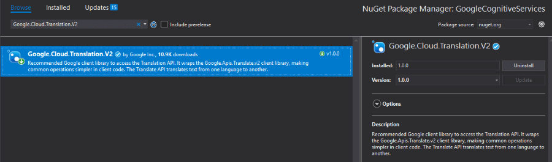
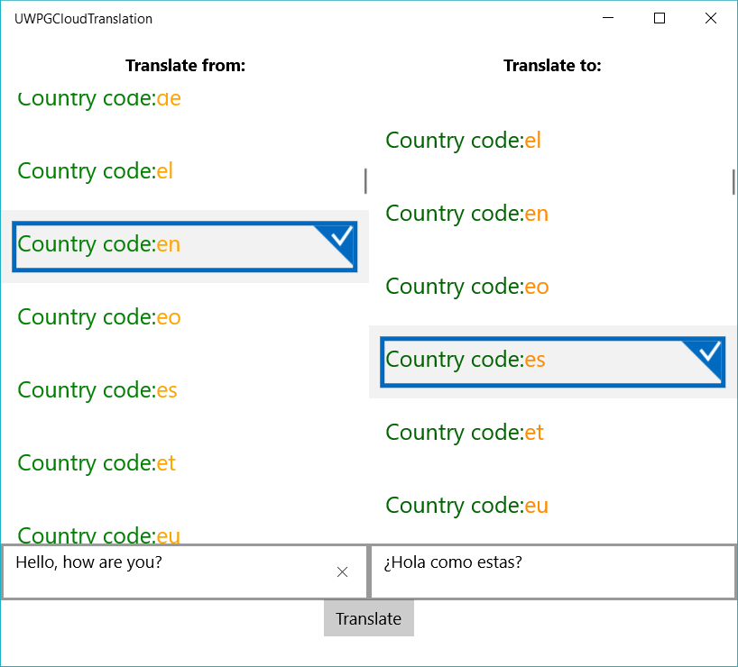

# Translation

In this article we are going to show you how to use Google's Translation API. The process of embedding the functionality in your .NET application is very easy once you have enabled the feature from your [GCP console](https://console.cloud.google.com/).

## Step 1: Create the {{ site.framework_name }} Application

Create a standard {{ site.framework_name }} application with the following setup. Two RadListView controls will be used to choose the languages from and to which the translation will be applied:

#### __[XAML] Example 1: Defining the view__

	<Grid >
        <Grid.ColumnDefinitions>
            <ColumnDefinition Width="*" />
            <ColumnDefinition />
        </Grid.ColumnDefinitions>
        <Grid.RowDefinitions>
            <RowDefinition Height="Auto" />
            <RowDefinition />
        </Grid.RowDefinitions>

        <Grid>
            <Grid.RowDefinitions>
                <RowDefinition Height="50"/>
                <RowDefinition Height="400"/>
                <RowDefinition Height="50"/>
            </Grid.RowDefinitions>
            <TextBlock Text="Translate from:" FontWeight="Bold" VerticalAlignment="Center" HorizontalAlignment="Center"/>
            <data:RadListView ItemsSource="{Binding Languages}"
                              SelectedItem="{Binding SourceLanguageCode, Mode=TwoWay}"
                              Grid.Row="1">
                <data:RadListView.ItemTemplate>
                    <DataTemplate>
                        <StackPanel Orientation="Horizontal">
                            <TextBlock Text="Country code:  " Foreground="Green"></TextBlock>
                            <TextBlock Text="{Binding Code}" Foreground="Orange"></TextBlock>
                        </StackPanel>
                    </DataTemplate>
                </data:RadListView.ItemTemplate>
            </data:RadListView>

            <TextBox Text="{Binding SourceLanguageText, Mode=TwoWay, UpdateSourceTrigger=PropertyChanged}" 
                     PlaceholderText="Text to translate"
                     Grid.Row="2"/>
        </Grid>

        <Grid Grid.Column="1">
            <Grid.RowDefinitions>
                <RowDefinition Height="50"/>
                <RowDefinition Height="400"/>
                <RowDefinition Height="50"/>
            </Grid.RowDefinitions>
            <TextBlock Text="Translate to:" FontWeight="Bold" VerticalAlignment="Center" HorizontalAlignment="Center"/>
            <data:RadListView ItemsSource="{Binding Languages}"
                              SelectedItem="{Binding TargetLanguageCode, Mode=TwoWay}"
                              Grid.Row="1">
                <data:RadListView.ItemTemplate>
                    <DataTemplate>
                        <StackPanel Orientation="Horizontal">
                            <TextBlock Text="Country code:  " Foreground="DarkGreen"></TextBlock>
                            <TextBlock Text="{Binding Code}" Foreground="DarkOrange"></TextBlock>
                        </StackPanel>
                    </DataTemplate>
                </data:RadListView.ItemTemplate>
            </data:RadListView>

            <TextBox Text="{Binding TranslatedLanguageText, Mode=TwoWay}" 
                     PlaceholderText="Translated Text..."
                     Grid.Row="2"/>
        </Grid>

        <Button Grid.Row="1" 
                Grid.ColumnSpan="2" 
                Content="Translate" 
                Command="{Binding TranslateTextCommand}"  
                VerticalAlignment="Top" 
                HorizontalAlignment="Center"/>
    </Grid>

## Step 2: Install the NuGet package

Open the NuGet Package Manager and install the **Google.Cloud.Translation.V2** package.

## Step 3: Define the ViewModel

The next step is to create the ViewModel. It will need a [TranslationClient](https://googlecloudplatform.github.io/google-cloud-dotnet/docs/Google.Cloud.Translation.V2/api/Google.Cloud.Translation.V2.TranslationClient.html) object which will be used for calling the Translation API. We also need to implement the command that will call the Translation API via the TranslationClient. 

#### __[C#] Example 2: Defining the ViewModel__

    public class TranslationViewModel : ViewModelBase
    {
        TranslationClient client = null;
        private string jsonPath = @"your authentication json";
        private IList<Language> languages;

        private string sourceLanguageText = string.Empty;
        private string translatedLanguageText;
        private Language sourceLanguageCode;
        private Language targetLanguageCode;

        public TranslationViewModel()
        {
            var credentials = GoogleCredential.FromJson(jsonPath);
            this.client = TranslationClient.Create(credentials);
            this.Languages = client.ListLanguages();
            this.TranslateTextCommand = new Command(()=> OnTranslateText(null));
        }

        public Command TranslateTextCommand { get; set; }

        public string SourceLanguageText
        {
            get
            {
                return this.sourceLanguageText;
            }

            set
            {
                if (this.sourceLanguageText != value)
                {
                    this.sourceLanguageText = value;
                    this.OnPropertyChanged("SourceLanguageText");
                }
            }
        }

        public Language SourceLanguageCode
        {
            get { return sourceLanguageCode; }
            set
            {
                sourceLanguageCode = value;
                this.OnPropertyChanged("SourceLanguageCode");
            }
        }

        public Language TargetLanguageCode
        {
            get { return targetLanguageCode; }
            set
            {
                targetLanguageCode = value;
                this.OnPropertyChanged("TargetLanguageCode");
            }
        }

        public IList<Language> Languages
        {
            get { return this.languages; }
            set { this.languages = value; }
        }

        public string TranslatedLanguageText
        {
            get
            {
                return this.translatedLanguageText;
            }

            set
            {
                if (this.translatedLanguageText != value)
                {
                    this.translatedLanguageText = value;
                    this.OnPropertyChanged("TranslatedLanguageText");
                }
            }
        }

        private void OnTranslateText(object obj)
        {
            this.TranslatedLanguageText = client.TranslateText(this.SourceLanguageText, this.TargetLanguageCode.Code, sourceLanguage: this.SourceLanguageCode.Code).TranslatedText;
        }
    }

Where the Command class is implemented as follows:

	public class Command : ICommand
    {
        private Action _action;

        public Command(Action action)
        {
            this._action = action;
        }

        public event EventHandler CanExecuteChanged;
        public bool CanExecute(object parameter)
        {
            return true;
        }

        public void RaiseCanExecuteChanged()
        {
            this.CanExecuteChanged?.Invoke(this, EventArgs.Empty);
        }

        public virtual void Execute(object parameter)
        {
            this._action();
        }
    }

Note that the ItemsSource of the RadListView elements is a list of [Language](https://googlecloudplatform.github.io/google-cloud-dotnet/docs/Google.Cloud.Translation.V2/api/Google.Cloud.Translation.V2.Language.html) objects returned from the **ListLanguages** method of the TranslationClient. The Language objects have two important properties: Name and Code. 

> You can also authenticate through the **GoogleCredential.GetApplicationDefault** method . In order for it to get your credentials, you need to have a GOOGLE_APPLICATION_CREDENTIALS environment variable set pointing to the JSON file downloaded when creating a [service account](https://cloud.google.com/docs/authentication/getting-started#creating_a_service_account).

All that is left is to set the DataContext to the ViewModel.

#### __[C#] Example 3: Set the DataContext__

    public MainWindow()
	{
		InitializeComponent();

		this.DataContext = new TranslationViewModel();
	}

#### Figure 1: Result from example after translation 

## See Also

- [Google Cloud Overview]()
- [Google Cloud DataStore]()
- [Google Cloud MySQL Database]()
