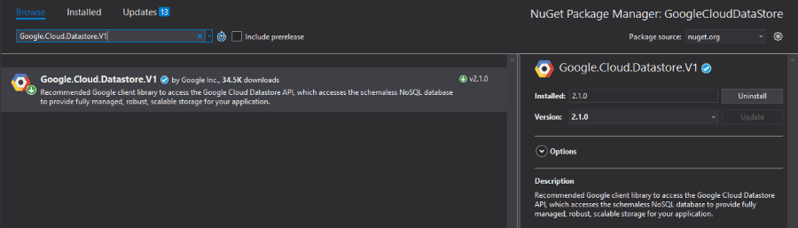
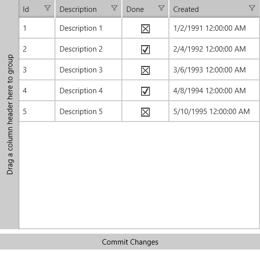

# Google Cloud Datastore(NoSQL database)

Cloud Datastore is a highly-scalable NoSQL database which Google promotes for scenarios that require high-availabilty and durability, and is capable of multiple features such as ACID transactions, SQL-like queries, indexes and many more. This in combination with the characteristic for the NoSQL database solutions of being able to handle different data types, great scalability and the great performance makes it a choice you should have in mind when considering the architecture of your application. 

>You can find more detailed information regarding the **Cloud Datastore** product on its [official documentation page](https://cloud.google.com/datastore/docs/).

The purpose of this article is to familiarize you with the .NET API designed for the product and show you how you can manipulate the database - add, retrieve and update items from it. 

## Prerequisites

For the purpose of this example, you have to enable the Google Cloud DataStore API. Please read the [Getting Started]() article for more information on how you can achieve that. You also have to set up a DataStore instance which can be done by following the [Datastore Quickstart](https://cloud.google.com/datastore/docs/quickstart#store_data) tutorial. 

## Step 1: Create the {{ site.framework_name }} Application

Create a standard {{ site.framework_name }} application and add a [RadDataGrid](). It will provide an interface to update the entities in your DataStore instance.

#### __[XAML] Example 1: Defining the view__

    <Grid>
        <Grid.RowDefinitions>
            <RowDefinition/>
            <RowDefinition Height="50"/>
        </Grid.RowDefinitions>
        <grid:RadDataGrid x:Name="dataGrid" 
                          ItemsSource="{Binding Tasks}">
        </grid:RadDataGrid>
        <Button Command="{Binding CommitChangesCommand}" 
                HorizontalAlignment="Stretch"
                VerticalAlignment="Center"
                Grid.Row="1"
                Content="Commit Changes"></Button>
    </Grid>

## Step 2: Install the NuGet package

Open the NuGet Package Manager and install the **Google.Cloud.Datastore.V1** package.

## Step 3: Define the business object

**Example 2** shows the **Task** class which will hold the example data. The **Id** property will be used for retrieving the item from the DataStore instance.

#### __[C#] Example 2: Defining the Task class__

    public class Task
    {
        public long Id { get; set; }

        public string Description { get; set; }

        public bool Done { get; set; }

        public DateTime Created { get; set; }
    }

## Step 4: Define the ViewModel

The next step is to create the ViewModel. It will need a [DatastoreDb](https://googlecloudplatform.github.io/google-cloud-dotnet/docs/Google.Cloud.Datastore.V1/api/Google.Cloud.Datastore.V1.DatastoreDb.html) object which will be responsible for adding, retrieving and updating entities from the DataStore instance and a [KeyFactory](https://googlecloudplatform.github.io/google-cloud-dotnet/docs/Google.Cloud.Datastore.V1/api/Google.Cloud.Datastore.V1.KeyFactory.html) object which will create keys.

#### __[C#] Example 3: Defining the ViewModel__

	public class ViewModel : ViewModelBase
    {
        private DatastoreDb db;
        private KeyFactory keyFactory;
        public ObservableCollection<Task> Tasks { get; set; }
        public ICommand CommitChangesCommand { get; set; }

        public ViewModel(string projectId)
        {

            this.db = DatastoreDb.Create(projectId);
            this.keyFactory = db.CreateKeyFactory("Task");
            this.AddTasksToDataStore(5);
            this.Tasks = this.GetTasksFromDataStore();
            this.CommitChangesCommand = new Command(() => OnEditEnded(null));
        }

        private void AddTasksToDataStore(int numberOfTasks)
        {
            for (int i = 0; i < numberOfTasks; i++)
            {
                this.AddTask($"Task {i}");
            }
        }

        Google.Cloud.Datastore.V1.Key AddTask(string description)
        {
            Entity task = new Entity()
            {
                Key = keyFactory.CreateIncompleteKey(),
                ["Description"] = new Value()
                {
                    StringValue = description,
                    ExcludeFromIndexes = true
                },
                ["Created"] = DateTime.UtcNow,
                ["Done"] = false
            };
            return db.Insert(task);
        }

        private ObservableCollection<Task> GetTasksFromDataStore()
        {
            ObservableCollection<Task> tasksToReturn = new ObservableCollection<Task>();
            Query query = new Query("Task");
            DatastoreQueryResults tasks = db.RunQuery(query);

            foreach (var entity in tasks.Entities)
            {
                Task task = new Task();
                task.Done = (bool)entity["Done"];
                task.Created = (DateTime)entity["Created"];
                task.Description = (string)entity["Description"];
                task.Id = entity.Key.Path[0].Id;
                tasksToReturn.Add(task);
            }

            return tasksToReturn;
        }

        private void OnEditEnded(object obj)
        {
            foreach (var task in this.Tasks)
            {
                Google.Cloud.Datastore.V1.Key key = keyFactory.CreateKey(task.Id);
                var entity = db.Lookup(key);

                entity["Done"] = task.Done;
                entity["Description"] = task.Description;
                entity["Created"] = task.Created;

                db.Update(entity);
            }
        }
    }

Where the Command class is defined as follows:

    public class Command : ICommand
    {
        private Action _action;

        public Command(Action action)
        {
            this._action = action;
        }

        public event EventHandler CanExecuteChanged;
        public bool CanExecute(object parameter)
        {
            return true;
        }

        public void RaiseCanExecuteChanged()
        {
            this.CanExecuteChanged?.Invoke(this, EventArgs.Empty);
        }

        public virtual void Execute(object parameter)
        {
            this._action();
        }
    }

In the **AddTasksToDataStore** method we are adding a couple of Task entities which have the same properties as our Task class. Then in the **GetTasksFromDataStore** method we are retrieving the entities from the DataStore instance, converting them to Task objects and adding them to an ObservableCollection which will be the ItemsSource of our RadDataGrid. In the **OnEditEnded** method which is called when the commit button is clicked, we are using the **Id** property of the Task objects in order to retrieve the correct entity from the DataStore instance, modify it and update it. 

> In order to connect to the DataStore database, you need to have a GOOGLE_APPLICATION_CREDENTIALS environment variable set pointing to the JSON file downloaded when [creating a service account](https://cloud.google.com/docs/authentication/getting-started#creating_a_service_account).

<!-- -->

> For more information on Datastore API, check out the [Getting started with the Google Cloud Datastore API](https://cloud.google.com/datastore/docs/datastore-api-tutorial) article.

## Step 5: Set the DataContext

All that is left is to set the DataContext to the ViewModel and pass your project id as a parameter. Please note that we are preventing the generation of a field for the **Id** property of the Task objects since we only need it for retrieving the correct entity from the DataStore.

#### __[C#] Example 4: Set the DataContext__

    public sealed partial class MainPage : Page
    {
        public MainPage()
        {
            this.InitializeComponent();
            string projectId = "my-project-id";
            this.DataContext = new ViewModel(projectId);
        }
    }

>In order to locate your project id, please read the [Locate the project ID](https://support.google.com/cloud/answer/6158840?hl=en) help article. 

#### Figure 1: RadDataGrid appearance 

## See Also

* [Google Cloud Cloud Storage]()
* [Google Cloud Translation]()