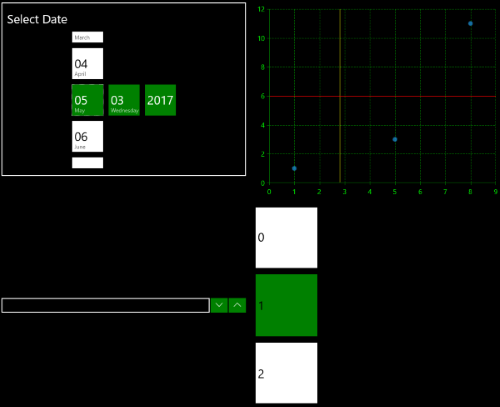

# Accessibility

Nowadays in the world there are many disablities such as limitations in mobility, vision, color perception, hearing etc. Using the built-in accessibility functionalities of the  **Telerik UI for Universal Windows Platform** controls introduced with __R2 2017__ these disablities could easily be overcome. The controls provide keyboard support and support for assistive technologies such as screen readers, which take advantage of accessibility frameworks. The high contrast themes of the OS are supported as well and they make the interface easier to see.

In this article, we will go through all these accessibility functionalities:

* [UI Automation](#ui-automation)

* [Keyboard support](#keyboard-support)

* [High Contrast Themes](#high-contrast-themes)

## UI Automation

All controls provides built-in support for Microsoft UI Automation – the accessibility framework for Microsoft Windows. UI Automation support is implemented through a tree of peer classes that derive from FrameworkElementAutomationPeer. Each control class uses the UI Automation concepts of automation peers and automation patterns that report the control's role and content to UI Automation clients. We follow the convention about naming the peer classes – they begin with the control class name and end with “AutomationPeer”.

A screen reader needs to be used in order the user to be able to receive all the needed information provided by the UI Automation. The screen reader read read the text associated with the specific control when it receives focus.

## Keyboard support

Each control provides a keyboard navigation of its own based on the needs of the control. That provides the ability for people with vision limitations to easily use the controls and to accomplish basic application scenarios by using only the keyboard. In order the keyboard to be used the control must be focused.  

The controls support tab navigation and could easly gain the focus - by default, the tab order of the contols is the same as the order they are listed in XAML or programmatically added to the application. If you want to exclude a control from the Tab order the **IsTabStop** property of the control should be set to false.

For the controls that can be invoked a keyboard support for the Spacebar and Enter keys is implemented. The arrow keys has also been implemented for navigation among child elements, in cases where the child elements have a special relationship to each other.

## High Contrast Themes

The OS supports a group of high contrast themes from which the users can choose to enable. These themes makes the controls easier to see and are of gread help for people with vision limitations. When the theme is switched to a high contrast all the UI controls will use an appropriate high contrast theme as well.

In figure 1 you could see how the RadDatePicker, RadLoopingList, RadNumericBox and RadChart controls are visualized when the theme is changed to a high contrast theme:

#### __Figure 1: High Contrast Theme support__

