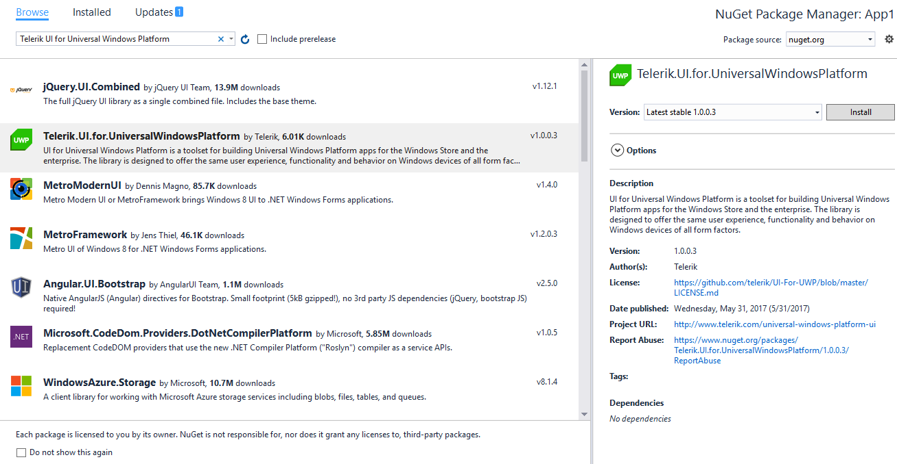
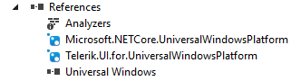
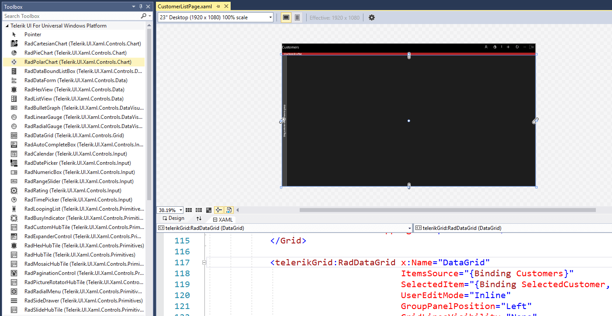

# Nuget Toolbox Support

The Telerik UI for UWP controls provide a pre-build NuGet package. The package contains all the assemblies from the UI for UWP suite.

In this article, we will go through the installation of the package and the features it provides:

* [Installing UWP Controls Package](#installing-uwp-controls-package)

* [Toolbox support](#toolbox-support)

## Installing UWP Controls Package

The next steps show how to install the complete NuGet package which includes all the assemblies.

Once you open the “Manage NuGet Packages” dialog in Visual Studio (right-click Project References -> Manage NuGet Packages), you can select the "Browse" tab and search for "Telerik UI for Universal Windows Platform" - please, be aware that the package source should be nuget.org.

#### __Figure 1: Manage NuGet Packages dialog__

After the package is found click the "Install" button and the package will be included in the project.

#### __Figure 2: Installed NuGet Package__

## Toolbox support

With Visual Studio 2017 a Toolbox support has been added for the NuGet packaged to easily view and categorize the controls. As soon as the NuGet package is referenced, the controls it contains will appear in the Toolbox for you to use in your application. These controls can be used just like any other Toolbox control, with drag and drop support on the design surface.

#### __Figure 3: NuGet Toolbox support__

