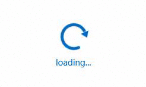
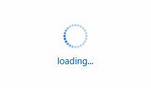
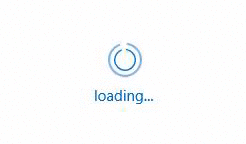
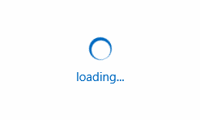
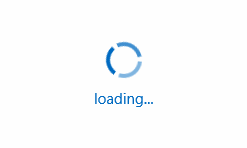
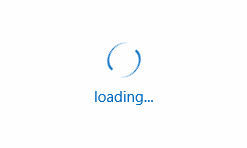

# Animation Types

**RadBusyIndicator** supports 9 animation types out-of-the-box that can be used by setting the AnimationStyle property.

The **AnimationStyle** property allows you to specify the type of animation currently played by RadBusyIndicator. The control supports 9 predefined animation styles which are defined by the values exposed by the AnimationStyle enum:

* **AnimationStyle1**  

* **AnimationStyle2**  

* **AnimationStyle3**  

* **AnimationStyle4**  

* **AnimationStyle5**  

* **AnimationStyle6**  

* **AnimationStyle7**  

* **AnimationStyle8**  

* **AnimationStyle9**  

