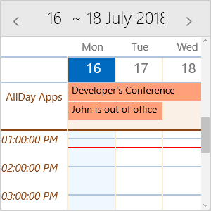

# MultiDayView

RadCalendar for UWP provides MultiDayView mode which enables the end-user to have a detailed view of the schedule for a specific day (or days). You could visualize between 1 and 7 days at once on the DayView area.

In order to enable it you need to set **DisplayMode** property of RadCalendar to “MultiDayView”.

	<telerikInput:RadCalendar x:Name="calendar"
		  Width="300" Height="300"                                
		  DisplayMode="MultiDayView" />

The next image shows the default look of MultiDayView:

		  
## Key Features

This section lists the key properties of MultiDayView you could use to set its time ruler and AllDayArea, so that the Calendar best suits your needs. 

* **VisibleDays**: Defines the number of days visualized on the DayView area. The default is 7 days.
* **DayStartTime**: Defines the time used to indicate the start of the time ruler. The default value of the DayStartTime is 00:00:00 or 12:00 AM.
* **DayEndTime**: Sets the time used to indicate the end of the time ruler. 
* **TimerRulerTickLength**: This property is of type *TimeSpan* and defines the density of the time ruler items.
* **TimeLinesSpacing**: Defines the space between the lines on the DayView area in pixels.
* **ShowCurrentTimeIndicator**: Provides the option to visually mark the current time in the time ruler and across the view. By default, it is True.

All of the above are applied using the **MultiDayViewSettings** property of RadCalendar. Here is a quick example on how they could be set:

	<telerikInput:RadCalendar x:Name="calendar"
                Width="300" Height="300"                                
                DisplayMode="MultiDayView">
		<telerikInput:RadCalendar.MultiDayViewSettings>
			<telerikInput:MultiDayViewSettings VisibleDays="1"
									DayStartTime="8:00:00"
									DayEndTime="18:00:00"
									TimerRulerTickLength="01:00:00"
									TimeLinesSpacing="20"
									ShowCurrentTimeIndicator="True" />
		</telerikInput:RadCalendar.MultiDayViewSettings>
	</telerikInput:RadCalendar>

And the result after applying these settings:

	
MultiDayView provides AllDay area used to display appointments for the whole day. Following are the properties related to AllDay area:

* **ShowAllDayArea**: Defines whether the AllDay area will be shown.
* **AllDayAreaText**: Specifies the Text shown inside TimeRuler next to the AllDay area.
* **AllDayMaxVisibleRows**: Specifies how may rows will be visible in AllDay area.
* **AllDayAppointmentMinHeight**: Sets the height of the appointments inside AllDay area.
* **AllDayAppointmentSpacing**: Defines the gap between appointments inside AllDay area.  

The last three properties define the overall height of the AllDay area.

	<telerikInput:RadCalendar x:Name="calendar"
					Width="300" Height="300"                                
					DisplayMode="MultiDayView"
					AppointmentSource="{Binding Appointments}">
		<telerikInput:RadCalendar.MultiDayViewSettings>
			<telerikInput:MultiDayViewSettings VisibleDays="1"                           
									ShowAllDayArea="True"
									AllDayAreaText="AllDay Apps"
									AllDayMaxVisibleRows="2"
									AllDayAppointmentMinHeight="25"
									AllDayAppointmentSpacing="1"/>
		</telerikInput:RadCalendar.MultiDayViewSettings>
	</telerikInput:RadCalendar>

And here is how the AllDay area looks:

	
## Special Slots

Using MultiDayView you can define special slots and apply different styles to them. You just need to prepare a collection of Slot objects and assign it to **SpecialSlotsSource** property of the MultiDayViewSettings. 

Each Slot has the following properties:

* **Start** - start date of the Slot. 
* **End** - end date of the Slot. 

Additionally, by utilizing the **SpecialSlotStyleSelector** you could define different Styles according to a certain condition.  

Let’s, for example, create a collection of Special Slots containing the nonworking hours during the current week as well as a separate slot marking the working hours on Friday:

	var today = DateTime.Now.Date;
	var start = today.AddHours(9);
	var end = today.AddHours(18);

	var SpecialSlots = new ObservableCollection<Slot>();

	for (int i = 0; i < 7; i++)
	{
		SpecialSlots.Add(new Slot(today.AddDays(i), start.AddDays(i).AddHours(9)));
		SpecialSlots.Add(new Slot(end.AddDays(i), today.AddDays(i).AddHours(24)));
	}

	var thisFriday = today.AddDays(DayOfWeek.Friday - today.DayOfWeek).Date;
	SpecialSlots.Add(new Slot(thisFriday.AddHours(9), thisFriday.AddHours(18)));

Then, create the SpecialStyleSelector which returns different Styles for nonworking slots and for Friday hours:

	public class SpecialSlotStyleSelector : StyleSelector
	{
		public Style NonWorkingHours { get; set; }
		public Style SpecialHours { get; set; }

		protected override Style SelectStyleCore(object item, DependencyObject container)
		{
			Slot slot = (Slot)item;
			if (slot.Start.Hour < 9 || slot.Start.Hour >= 18)
			{
				return this.NonWorkingHours;
			}

			return this.SpecialHours;
		}
	}

Here is the SpecialSlotStyleSelector representation inside the page Resources:

	<example:SpecialSlotStyleSelector x:Key="SpecialSlotStyleSelector">
		<example:SpecialSlotStyleSelector.NonWorkingHours>
			
		</example:SpecialSlotStyleSelector.NonWorkingHours>
		<example:SpecialSlotStyleSelector.SpecialHours>
			
		</example:SpecialSlotStyleSelector.SpecialHours>
	</example:SpecialSlotStyleSelector>

Finally, set the SpecialSlotsSource and SpecialSlotStyleSelector properties of the MultiDayView:

	<telerikInput:RadCalendar x:Name="calendar"
						Width="300" Height="300"
						DisplayMode="MultiDayView">
		<telerikInput:RadCalendar.MultiDayViewSettings>
			<telerikInput:MultiDayViewSettings VisibleDays="5"
				TimeLinesSpacing="40"
				SpecialSlotsSource="{Binding SpecialSlots}"
				SpecialSlotStyleSelector="{StaticResource SpecialSlotStyleSelector}" />
		</telerikInput:RadCalendar.MultiDayViewSettings>
	</telerikInput:RadCalendar>

The next screenshot demonstrates how the applied special slots styling will look.

## Styling

MultiDayView provides means for customizing its look & feel through various styling properties. You could check them below:

* **TimeRulerItemStyleSelector**: StyleSelector used to apply the style of the horizontal and vertical lines as well as the TimeRuler labels.
* **CurrentTimeIndicatorStyle**: Sets the Style applied to CurrentTimeIndicator shown across the view to mark the current time.
* **TodaySlotStyle**: Defines the Style of the Slot that represents the current day.
* **AllDayAreaBackground**: This property is of type *Brush* and sets the background color of the AllDay area.
* **AllDayAreaBorderStyle**: Sets the Style of the Border wrapped around the AllDay area.                                          
* **AllDayAreaTextStyle**: Defines the Style applied to AllDayAreaText.

The snippet below demonstrates how the styling options could be applied:

	<telerikInput:RadCalendar x:Name="calendar"
						Width="300" Height="300"
						DisplayMode="MultiDayView"
						AppointmentSource="{Binding Appointments}">
		<telerikInput:RadCalendar.MultiDayViewSettings>
			<telerikInput:MultiDayViewSettings VisibleDays="3"        
				  AllDayMaxVisibleRows="2"
				  AllDayAppointmentMinHeight="25"
				  TimeLinesSpacing="40"
				  AllDayAreaBackground="Linen"
				  TodaySlotStyle="{StaticResource TodaySlotStyle}"          
				  CurrentTimeIndicatorStyle="{StaticResource CurrentTimeIndicatorStyle}"  
				  TimeRulerItemStyleSelector="{StaticResource CalendarTimeRulerItemStyleSelector}"
				  AllDayAreaBorderStyle="{StaticResource CustomAllDayAreaBorderStyle}"
		          AllDayAreaTextStyle="{StaticResource CustomAllDayAreaTextStyle}"/>
		   </telerikInput:RadCalendar.MultiDayViewSettings>
	</telerikInput:RadCalendar>

And here is how the referenced StaticResources are defined:

	
	
	
	
	<telerikCalendar:CalendarTimeRulerItemStyleSelector x:Key="CalendarTimeRulerItemStyleSelector">
		<telerikCalendar:CalendarTimeRulerItemStyleSelector.HorizontalLineStyle>
			
		</telerikCalendar:CalendarTimeRulerItemStyleSelector.HorizontalLineStyle>
		<telerikCalendar:CalendarTimeRulerItemStyleSelector.VerticalLineStyle>
			
		</telerikCalendar:CalendarTimeRulerItemStyleSelector.VerticalLineStyle>
		<telerikCalendar:CalendarTimeRulerItemStyleSelector.TimeLabelStyle>
			
		</telerikCalendar:CalendarTimeRulerItemStyleSelector.TimeLabelStyle>
	</telerikCalendar:CalendarTimeRulerItemStyleSelector>

where *telerikCalendar* namespace is declared like this:

	xmlns:telerikCalendar="using:Telerik.UI.Xaml.Controls.Input.Calendar"
	
Check the result in the screenshot below:

