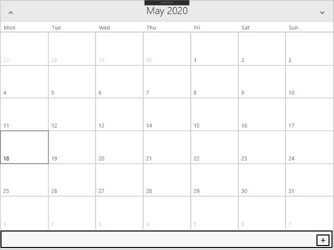

# Properties And Configuration

## Properties

* **DisplayMode** (CalendarDisplayMode): Gets or sets the display mode of the RadCalendar control. The available values are:
	* MonthView (default)
	* YearView
	* DecadeView
	* CenturyView
* **DisplayDateStart** (DateTime): Gets or sets the first date to be displayed.
* **DisplayDateEnd** (DateTime): Gets or sets the last date to be displayed.
* **DisplayDate** (DateTime): Gets or sets the current date to display. By default this is the today date.
* **IsTodayHighlighted** (bool): Gets or sets a value that indicates whether the current date will be highlighted.
* **DayNamesVisibility** (Visibility): Gets or sets a value indicating whether the day name column headers should be visible MonthView mode. The available values are:
	* Visible (default)
	* Collapsed
* **WeekNumbersVisibility** (Visibility): Gets or sets a value indicating whether the week number row headers should be visible in MonthView mode. The available values are:
	* Visible (default)
	* Collapsed
* **DayNameFormat** (CalendarDayNameFormat): Gets or sets the days of the week formatting in the calendar column headers in MonthView mode.The available formats are:
	* AbbreviatedName (default): Displays abbreviated name (first 3 letters) of the weekday.
	* FirstLetter: Displays only the first letter of the weekday.
	* FullName: Displays the full name of the weekday.
* **WeekNumberFormat** (string): Gets or sets the week number formatting in the calendar row headers in MonthView mode.
* **SelectionMode** (CalendarSelectionMode): Gets or sets the selection mode of the calendar control.The available modes are:
	* Single (default)
	* Multiple
	* None
* **[Selection Properties]()**
* **[CellStyling Properties]()**

### HeaderFormats 

The following properties get or set the format of the navigation header in different view modes:

* **MonthViewHeaderFormat** (string): The default value is "{0:MMMM yyyy}".
* **YearViewHeaderFormat** (string): The default value is "{0:yyyy}".
* **DecadeViewHeaderFormat** (string): The default value is "{0:yyyy} ~ {1:yyyy}".
* **CenturyViewHeaderFormat** (string): The default value is "{0:yyyy} ~ {1:yyyy}".

### FooterVisibility

With R2 2020 Official Release of Telerik UI for UWP, the RadCalendar control provides the option to toggle its the footer visibility through the following property:
 
* **FooterVisibility**(*Windows.UI.Xaml.Visivility*): Specifies the display state of the footer. The default value is *Collapsed*. In order to visualize the footer you need to set **FooterVisibility** to *Visible*.

>note In adition when the FooterVisibility is Visible a `+` button is displayed inside the footer. The button has the **FooterButtonClicked** event which occurs when the `+` button is clicked.

The image below shows how the calendar looks when FooterVisibility is set to Visible:

### CellFormats

The following properties get or set the format of the cell content in different view modes:

* **MonthViewCellFormat** (string): The default value is "{0:%d}".
* **YearViewCellFormat** (string): The default value is "{0:MMMM}".
* **DecadeViewCellFormat** (string): The default value is "{0:yyyy}".
* **CenturyViewCellFormat** (string): The default value is "{0:yyyy} ~ {1:yyyy}".

