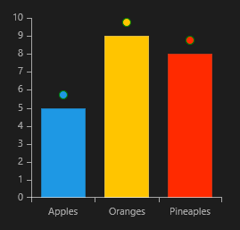

# Label Strategy

When you want to fully customize the labels of your chart, you can use Label Strategy to override the labels' appearance, content and layout.

## Properties

In order to use Label Strategy you have to greate a class inheriting the **ChartSeriesLabelStrategy**
class and specify the **LabelStrategyOptions** you wish to customize, and override their corresponding methods.

Here are listed all LabelStrategyOptions:

* **DefaultVisual**: The strategy will provide a custom visual element for each label. You have to override the **CreateDefaultVisual** method.

* **Measure**: The strategy will provide custom measurement logic for each label. You have to override the **GetLabelDesiredSize** method.

* **Content**: The strategy will provide custom content for each label. You have to override the **GetLabelContent** method. You can also override the **SetLabelContent** method used for UI virtualization and allows to reuse label content when panning and zooming.

* **Arrange**: The strategy will provide custom arrange logic for each label. You have to override the **GetLabelLayoutSlot** method.

For example:

	public LabelStrategyOptions options = LabelStrategyOptions.DefaultVisual | LabelStrategyOptions.Measure;

Or you can assign all values:

	public LabelStrategyOptions options = LabelStrategyOptions.All;

## Example

>tipYou can use the example for CartesianChart with BarSeries and add the LabelStrategy in the Series to see the result: [Example](74714019-86ba-4a69-8944-4de7eeea2536#CartesianBarSeriesExample)

>importantIf you use elements that do not have desired size you have to override the **GetLabelDesiredSize** method

	
	public class BarLabelStrategy : ChartSeriesLabelStrategy
	{
		public LabelStrategyOptions options = LabelStrategyOptions.DefaultVisual | LabelStrategyOptions.Measure;
		
		public override LabelStrategyOptions Options
		{
			get
			{
				return this.options;
			}
		}
		
		public override FrameworkElement CreateDefaultVisual(DataPoint point, int labelIndex)
		{
			ChartSeries series = point.Presenter as ChartSeries;
			return new Ellipse()
			{
				Stroke = new SolidColorBrush(Colors.Green),
				Fill = series.Chart.Palette.GetBrush(point.CollectionIndex, PaletteVisualPart.Fill)
			};
		}
		
		public override RadSize GetLabelDesiredSize(DataPoint point, FrameworkElement visual, int labelIndex)
			{
				return new RadSize(10, 10);
			}
		}
	
	}

 
	<local:BarLabelStrategy x:Name="Strategy"/> 

 
	<telerik:BarSeries.LabelDefinitions>
		<telerik:ChartSeriesLabelDefinition HorizontalAlignment="Center" Margin="0,0,0,10" Strategy="{StaticResource Strategy}"/>
	</telerik:BarSeries.LabelDefinitions>

