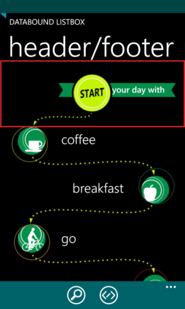
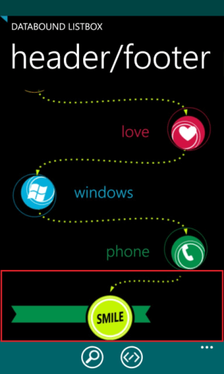

# Header and Footer

*RadDataBoundListBox* allows for defining a **Header** and a **Footer**. These are specialized visual items that are displayed at the beginning and at the end of the scrollable list and bring additional information to the end-user. The might also expose functionality like the *search* button found on the native phonebook of the Windows Phone OS. Setting a header or a footer is simply done by defining the desired *DataTemplate* and assigning it to the *ListHeaderTemplate, ListHeaderContent *or *ListFooterTemplate, ListFooterContent* property.

## Defining a Header

The following XAML code demonstrates how to define and set a header for the *RadDataBoundListBox* control:

	<telerikPrimitives:RadDataBoundListBox>
	    <telerikPrimitives:RadDataBoundListBox.ListHeaderTemplate>
	        <DataTemplate>
	            <StackPanel>
	                <Image Source="Images/HeaderAndFooter/header.png" Stretch="None" />
	                <TextBlock Text="your day with" HorizontalAlignment="Right" FontFamily="Segoe WP Semibold" FontSize="22" Margin="0, 23, 28, 0" />
	            </StackPanel>
	        </DataTemplate>
	    </telerikPrimitives:RadDataBoundListBox.ListHeaderTemplate>
	</telerikPrimitives:RadDataBoundListBox>

You can also use the *ListHeaderContent* property in context with *ListHeaderTemplate.*

## Defining a Footer

The following XAML code demonstrates how to define and set a footer for the *RadDataBoundListBox* control:

	<telerikPrimitives:RadDataBoundListBox>
	    <telerikPrimitives:RadDataBoundListBox.ListFooterTemplate>
	        <DataTemplate>
	            <StackPanel>
	                <Image Source="Images/HeaderAndFooter/footer.png" Stretch="None" />
	                <TextBlock Text="do it again" FontFamily="Segoe WP Semibold" FontSize="22" Margin="28, 23, 0, 0" />
	            </StackPanel>
	        </DataTemplate>
	    </telerikPrimitives:RadDataBoundListBox.ListFooterTemplate>
	</telerikPrimitives:RadDataBoundListBox>

You can also use the *ListFooterContent* property in context with *ListFooterTemplate*.

## Header and Footer display mode

**RadDataBoundListBox** exposes the *ListHeaderDisplayMode* and *ListFooterDisplayMode* properties. These
properties can be used to adjust the behavior of the header and footer depending on whether there are items in the source attached to the **DataBoundListBox** instance. The properties accept values from the **HeaderFooterDisplayMode** enum which are as follows:

* **AlwaysVisible** - header or footer are always displayed, no matter if the source is empty or not
* **WithDataItems** - header or footer are always displayed when there is at least 1 item in the attached data source.

Here is an example of how your *RadDataBoundListBox* could look like when using a **Header** and a **Footer:**

