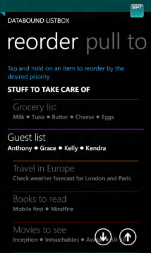

# Item Reorder

The **Item Reorder** functionality in DataBoundListBox
allows the end-user to reorder visual items in the list box' viewport also changing the
position of the items in the provided data source.

## Using the Item Reorder functionality in DataBoundListBox

To enable the Item Reorder feature in **DataBoundListBox** you need to set the **IsItemReorderEnabled** property to *true* and make sure that the provided data source implements the **IList** interface.

	<telerikPrimitives:RadDataBoundListBox x:Name="radDataBoundListBox" IsItemReorderEnabled="True"/>

Already enabled, the Item Reorder feature can be activated by holding on a the visual item that will be
target of reordering. In this case a popup is shown containing two buttons that shift the item position:

### Activating Item Reorder for a particular item programmatically

**RadDataBoundListBox** exposes the *ActivateItemReorderForItem* method which can be used to programmatically activate the reorder mode for a particular visual item. The method accepts the instance of the item to activate the reordering for.

### RadDataBoundListBox exposes the following events related to the reorder functionality:

* **ItemReorderUpButtonTap** - fired when the user taps the reorder button which shifts up the index of the item within the source collection. Fired at the end of the reordering within the source.
* **ItemReorderDownButtonTap** - fired when the user taps the reorder button which shifts down the index of the item within the source collection. Fired at the end of the reordering within the source.
* **ItemReorderStateChanged** - fired when the reorder controls are activated or deactivated. Can be used to track when the user has started or stopped the reordering mode. Information
about the state of the reordering mode is contained within the event arguments, as well as a reference to the visual container being reordered.

## Styling the Item Reorder popup

You can change the visual appearance of the Item Reorder popup via a **Style**
by setting the **ItemReorderControlStyle** property.

The following code snippet shows a sample style:

	