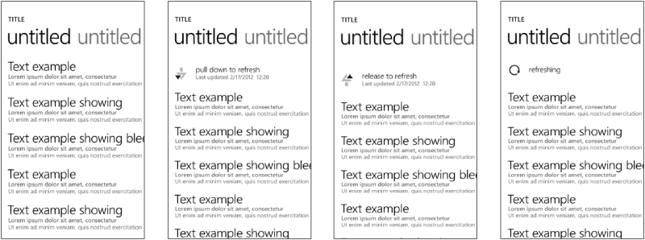

# Pull to Refresh

RadDataBoundListBox provides infrastructure that allows the end-user to
request a data refresh by pulling the top edge of the scrollable content down and
releasing it:

## Activating the Pull-to-Refresh mode

To activate the pull-to-refresh feature in RadDataBoundListBox you should set the *IsPullToRefreshEnabled* property to true. This will make the pull-to-refresh indicator appear on the top of the scrollable list.

## Using Pull-to-Refresh on an empty list

RadDataBoundListBox allows you to use the Pull-to-Refresh functionality even when there is no data to display. This will enable you to let your users make an initial data request by pulling and releasing the empty content view. To turn this functionality on, you need to set the *ShowPullToRefreshWhenNoData* property to *true*.

## Handling pull-to-refresh requests

When the end-user requests data via the pull-to-refresh user experience
the *RefreshRequested* event is fired by RadDataBoundListBox:

	this.radDataBoundListBox.RefreshRequested += (s, args) =>
    {
        // Make async data request and wait for the service callback e.g. OnDataArrived
    };

In the generic scenario this event is the point where an async request is made to a web service.

RadDataBoundListBox exposes the *StopPullToRefreshLoading* method which can be used to hide the pull-to-refresh indicator as soon as the requested data arrives. This method has an argument that can be used to determine whether the last-refresh-time label in the pull-to-refresh indicator is updated or not:

	private void OnDataArrived(IEnumerable newData)
	{
	    // Insert new data items at the beginning of the original source collection
	    foreach (object newItem in newData)
	    {
	        this.listBoxSource.Insert(0, newItem);
	    }
	
	    // Stop and hide the pull-to-refresh indicator by updating the last refresh time label.
	    this.radDataBoundListBox.StopPullToRefreshLoading(true);
	}

## Styling and modifying the Pull-to-Refresh Indicator

RadDataBoundListBox exposes the *PullToRefreshIndicatorStyle* property that
can be used to define the visual appearance of the pull-to-refresh indicator. Using this property you can easily define a different style
for it according to your application requirements. The pull-to-refresh indicator
is a custom control that is defined by the **Telerik.Windows.Controls.DataBoundListBox.PullToRefreshIndicatorControl** type.

### Defining custom Refresh Time format

The **PullToRefreshIndicatorControl** exposes the *RefreshTimeLabelFormat* property that accepts
string values and can be used to define a custom time format for the values
displayed in the last-refresh-time label.

The following code snippet demonstrates how a custom time format is set via a Style:
	
	<telerikDataControls:RadDataBoundListBox.PullToRefreshIndicatorStyle>
	    
	</telerikDataControls:RadDataBoundListBox.PullToRefreshIndicatorStyle>