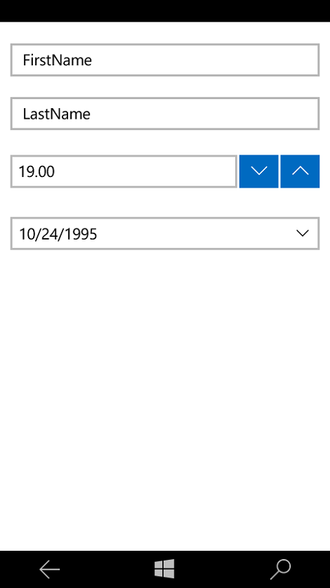

**RadDataForm** is easily setup by adding the control to a Page and setting its **Item** property to an object which properties are to be visualized in the Data Form. In order to use the control in your application you need to reference the following binaries:

1. Telerik.Core.dll
2. Telerik.Data.dll
4. Telerik.UI.Xaml.Input.dll
5. Telerik.UI.Xaml.Primitives.dll
3. Telerik.UI.Xaml.Controls.Data.dll

# Getting Started

After referencing the required assemblies you can proceed with setting up the control itself. The only property that is required to be set in order to visualize any data in our application is the Item property. It is of type object and gets or sets the business item that is about to be visualized. It is important to keep in mind that the control will resolve only the public properties of the business class by default.

# How the control works?

For each property exposed by the object set as **Item** the RadDataForm control creates an **EntityPropertyControl**. This control is responsible for visualizing the information held by the respective property. The RadDataForm supports out of the box the following types and creates the respective EntityPropertyControl:

- **bool** - BooleanEditor
- **string** - StringEditor
- **double** - NumericEditor
- **DateTime** - DateEditor or TimeEditor
- **enum** - EnumEditor

## Example

Create the business item

    public class UserData
    {
        private string name;
        public string Name
        {
            get
            {
                return name;
            }
            set
            {
                name = value;
            }
        }

        private string lastName;
        public string LastName
        {
            get
            {
                return lastName;
            }
            set
            {
                lastName = value;
            }
        }

        private int age;
        public int Age
        {
            get
            {
                return age;
            }
            set
            {
                age = value;
            }
        }

        private DateTime birthDate;
        public DateTime BirthDate
        {
            get
            {
                return birthDate;
            }
            set
            {
                birthDate = value;
            }
        }

        public UserData(string name = "", string lastName = "", int age = -1, DateTime birthDate = new DateTime())
        {
            this.Name = name;
            this.LastName = lastName;
            this.Age = age;
            this.BirthDate = birthDate;
        }
    }

Initialize the **RadDataForm** and add it to the page

	public MainPage()
    {
        this.InitializeComponent();

        var form = new RadDataForm();
        form.Item = new UserData("FirstName", "LastName", 19, new DateTime(1995, 10, 24));

        this.root.Children.Add(form);
    }

The result should be similar to the picture below.

Figure 1: 

