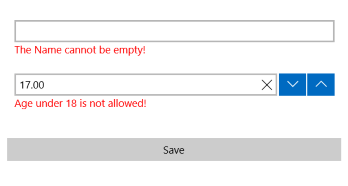

# Validation

In order DataForm to support validation the developer must implement the **ISupportEntityValidation** interface. This validator should be passed through the (link)EntityProvider **GetItemValidator** method.
The ValidateAsync method of this interface will be called from the RadDataForm depending on the RadDataForm.ValidationMode value.

The **ISupportEntityValidation** interface derrives from the well known **INotifyDataErrorInfo**, so the methodology is the same. The developer should implement **GetErrors** method, **HasErrors** property and should raise the **ErrorsChanged** event when the errors has been changed. Additionally when validation is needed the **ValidatePropertyAsync** method(which recieves the Entity object and the propertyName of the EntityProperty that should be validated) will be called.

- **OnCommit** - Validation will be triggered when an EntityProperty tries to commit a value.
- **Immediate** - Validation will be triggered whenever the user changes the value candidate.
- **OnLostFocus** - Validation will be triggered when the editor loses focus.

## Example

Let's have the following DataForm definition:

	<data:RadDataForm x:Name="DataForm" Item="{Binding}" CommitMode="OnLostFocus" ValidationMode="OnCommit"/>
	
Here is the used Item class that should implement *ISupportEntityValidation*:

	public class Item : ViewModelBase, ISupportEntityValidation
	{
		Dictionary<string, List<string>> errors = new Dictionary<string, List<string>>();

		private string name;
		public string Name
		{
			get { return this.name; }
			set { this.name = value; OnPropertyChanged("Name"); }
		}

		private double age;

		public event EventHandler<DataErrorsChangedEventArgs> ErrorsChanged;

		public double Age
		{
			get { return this.age; }
			set { this.age = value; OnPropertyChanged("Age"); }
		}

		public bool HasErrors
		{
			get
			{
				return this.errors.Count > 0;
			}
		}

		public Task ValidatePropertyAsync(Entity entity, string propertyName)
		{
			if (propertyName.Equals("Age"))
			{
				var property = entity.GetEntityProperty(propertyName);
				double value;
				Double.TryParse(property.PropertyValue.ToString(), out value);

				if (value < 18)
				{
					this.errors[propertyName] = new List<string>() { "Age under 18 is not allowed!" };
				}
				else
				{
					this.errors[propertyName] = new List<string>();
				}

				this.ErrorsChanged(this, new DataErrorsChangedEventArgs(propertyName));
			}
			else if (propertyName.Equals("Name"))
			{
				var name = entity.GetEntityProperty(propertyName).PropertyValue.ToString();
				if (String.IsNullOrEmpty(name))
				{
					this.errors[propertyName] = new List<string>() { "The Name cannot be empty!" };
				}
				else
				{
					this.errors[propertyName] = new List<string>();
				}

				this.ErrorsChanged(this, new DataErrorsChangedEventArgs(propertyName));
			}

				   
			return null;
		}

		public IEnumerable GetErrors(string propertyName)
		{
			if (this.errors.ContainsKey(propertyName))
			{
				return this.errors[propertyName];
			}

			return new List<string>();
		}
	}

Lastly, set the Item class as DataContext of the DataForm:

	this.DataContext = new Item() { Name = "Ivaylo", Age = 17 };
	
Here is the result:

