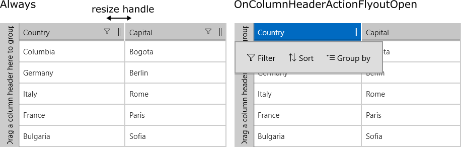

# Resize a Column with the UI

The **RadDataGrid** control supports manual resizing of the grid columns using a column resize handle. This article describes the different options for the resize UI.

## Display Mode

The display mode of the resize handle can be specified with the **ColumnResizeHandleDisplayMode** property of the grid. The possible values are:

- Always: The handle is always visible.
- OnColumnHeaderActionFlyoutOpen: The handle is displayed only when the [column header action flyout is open]().
- None: The handle is not visible. This is the default option. 

> If you set the **ColumnResizeHandleDisplayMode** to `OnColumnHeaderActionFlyoutOpen`, you have to also set the **ColumnDataOperationsMode** property to `Flyout`.

Here is an example:

	<telerikGrid:RadDataGrid ColumnDataOperationsMode="Flyout" ColumnResizeHandleDisplayMode="OnColumnHeaderActionFlyoutOpen"/>

See the full example setup in the [Example](#example) section of this article.

 
## Disable Resize UI for Specific Columns

The user can disable the resizing UI for specific columns with the **CanUserResize** column property.

	<telerikGrid:DataGridTextColumn PropertyName="Country" Header="Country" CanUserResize="False"/>

See the full example setup below.

## Example

To begin this example, we set the ItemsSource of a DataGrid:

	this.grid.ItemsSource = new List<Data>
	{
		new Data { Country = "Columbia", Capital = "Bogota" },
		new Data { Country = "Germany", Capital = "Berlin" },
		new Data { Country = "Italy", Capital = "Rome" },
		new Data { Country = "France", Capital = "Paris" },
		new Data { Country = "Bulgaria", Capital = "Sofia" },
	};

Data is our custom class, that represents our objects:

	public class Data
	{
		public string Country { get; set; }
	
		public string Capital { get; set; }
	}

Here's the XAML definition:

	<telerikGrid:RadDataGrid x:Name="grid" ColumnDataOperationsMode="Flyout" AutoGenerateColumns="False" ColumnResizeHandleDisplayMode="Always">
	    <telerikGrid:RadDataGrid.Columns>
	        <telerikGrid:DataGridTextColumn PropertyName="Country" Header="Country" CanUserResize="False"/>
	        <telerikGrid:DataGridTextColumn PropertyName="Capital" Header="Capital" />
	    </telerikGrid:RadDataGrid.Columns>
	</telerikGrid:RadDataGrid>