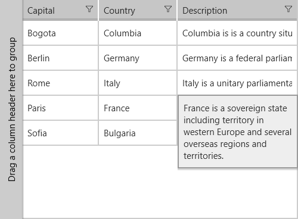

# Enable a Cell Context Flyout

This article describes how to use the enable context flyout for the column cells. 

The appearance of this flyout depends on IsCellFlyoutEnabled property. We’ll walk through an example that shows how to enable the flyout:

To begin this example, we set the ItemsSource of a DataGrid:

            this.grid.ItemsSource = new List<Data>
    {
        new Data { Country = "Columbia", Capital = "Bogota", Description = "Columbia is is a country situated in the northwest of South America, bordered to the northwest by Panama." },
        new Data { Country = "Germany", Capital = "Berlin", Description = "Germany is a federal parliamentary republic in West-Central Europe." },
        new Data { Country = "Italy", Capital = "Rome", Description = "Italy is a unitary parliamentary republic in Europe."  },
        new Data { Country = "France", Capital = "Paris", Description = "France is a sovereign state including territory in western Europe and several overseas regions and territories."  },
        new Data { Country = "Bulgaria", Capital = "Sofia", Description = "Bulgaria is a country in southeastern Europe."  },
    };

Data is our custom class, that represents our objects:

        public class Data
        {
            public string Country { get; set; }
            public string Capital { get; set; }

            public string Description { get; set; }
        }

Here's the XAML definition:

	<telerikGrid:RadDataGrid x:Name="grid" AutoGenerateColumns="False"  VerticalAlignment="Center">
	    <telerikGrid:RadDataGrid.Columns>
	        <telerikGrid:DataGridTextColumn PropertyName="Country" Header="Country" Width="100"/>
	        <telerikGrid:DataGridTextColumn PropertyName="Capital" Header="Capital" Width="200"/>
 			<telerikGrid:DataGridTextColumn PropertyName="Description" Header="Capital" Width="200"  IsCellFlyoutEnabled="True"/>
	    </telerikGrid:RadDataGrid.Columns>
	</telerikGrid:RadDataGrid>

If you are looking to alter the contents of the flyout displayed check [CellFlyoutAction command]().

