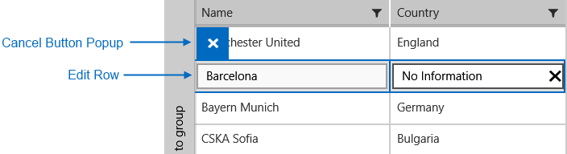
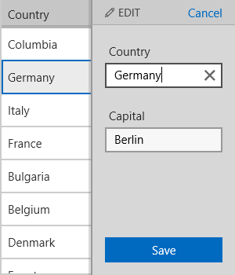

# Edit Operation

RadDataGrid allows editing an already populated items through the UI.

## Inline Editing

>First, the RadDataGrid.UserEditMode should be set to DataGridUserEditMode.**Inline**. 

Then, the following operations can be performed by a user:

1. The user can begin an edit operation over a row by performing a double tap gesture over a cell or by clicking the F2 button from the keyboard(begins an editing operation over the current row).
1. The user can cancel an edit operation over a row by clicking the Cancel button of the Editing UI or by clicking the Esc button from the keyboard. 
1. The user can commit an edit operation over a row by tap/click over another cell or by clicking the Enter button from the keyboard.

## External Editing

>First, the RadDataGrid.UserEditMode should be set to DataGridUserEditMode.**External**. 

Then, the following operations can be performed by a user:

1. The user can begin an edit operation over a row by performing a double tap gesture over a cell or by clicking the F2 button from the keyboard(begins an editing operation over the current row).
1. The user can cancel an edit operation over a row by clicking the Cancel button in the external editor UI. 
1. The user can commit an edit operation over a row by tap/click the Save button in the external editor UI.

## Programmatic Editing

RadDataGrid also allows a programmatic approach for editing through the following methods:

* **BeginEdit**(object item): Begins the edit operation for the specified data item.
* **CancelEdit**(): Cancels the current edit operation.
* **CommitEdit**(): Commits the current edit operation.