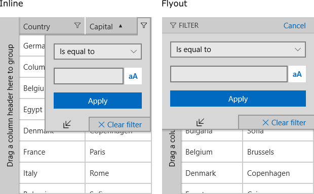

# Overview

RadDataGrid provides built-in filtering functionality, that allows the user to easily filter data by one or more columns - Filtering UI.
Everything that can be achieved by the end user through the UI can also be done by using the code-behind API.

## Programatic Filtering

RadDataGrid also allows programmatic approach for filtering. This can be achieved through RadDataGrid. FilterDescriptors property by adding FilterDescriptors.

RadDataGrid provides the following way of filtering:

* PropertyFilterDescriptor:
	* [Text Filter Descriptor]()
	* [Boolean Filter Descriptor]()
	* [Numerical Filter Descriptor]()
	* [DateTime Filter Descriptor]()
	* [Composite Filter Descriptor]()
* [Delegate Filter Descriptor]()

## Filtering UI

The built-in Filtering UI allows the user to easily filter data by column values.
The filtering functionality will be enabled out-of-the-box for most .NET primitive types such as strings, numeric types, DateTimes and so on.

>You can use the **UserFilterMode** property of RadGridView to enable/disable the filtering UI. To enable/disable the filtering of a specific column you can use the **CanUserFilter** property of the column.

There are two filter modes that depend on the value of the RadDataGrid.**ColumnDataOperationsDisplayMode** property.

- **Inline Filter UI**: The ColumnDataOperationsDisplayMode is set to **Inline**. The Filter UI is integrated in the column header.
- **Flyout Filter UI**: The ColumnDataOperationsDisplayMode is set to **Flyout**. The Filter UI is displayed with slide animation from the top of the grid.

### Functionality Overview

The default functonality of the **FilteringFlyout** UI will be discussed here. It consists of the following elements:

* **FirstFilterControl**: by default filter controls consist of:
	* Value
	* FilteringOperator

	See how to curtomize the control in [this]() topic.
* **SecondFilterControl**: it can be enabled/disabled using the **ExpandCollapseButton**.
* **LogicalOperator**: when the SecondFilterControl is enabled this operator defines the logic applied between the filter controls.
* **FilterButton**: applies the filtering options to the grid.
* **ExpandCollapseButton**: enables/disables the SecondFilterControl.
* **ClearFilterButton**: removes all filtering options of the FilteringFlyout control.

