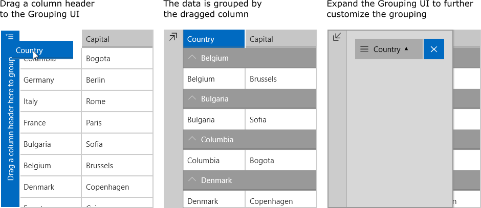

# Overview

The **RadDataGrid** control has a built-in **Grouping UI** and also provides programmatic approach for grouping. 

## Programmatic Grouping

Programmatic grouping can be done by adding group descriptors to the **GroupDescriptors** collection. There are two types of descriptors:

* **[PropertyGroupDescriptor]()**: using a property from the model as a group key.
* **[DelegateGroupDescriptor]()**: creates a custom group key.

> Each GroupDescriptor adds a new level of grouping.

## Grouping UI

The Grouping UI is enabled by design. You can enable/disable it through the **UserGroupMode** property. You can also control its position with the **GroupPanelPosition** property that supports two options: { Left, Bottom }

> Dragging a column header to the Grouping UI adds a PropertyGroupDeascriptor to the RadDataGrid.GroupDescriptors collection.

The Grouping UI supports the following actions:

- **Reorder**: You can reorder the elements in the Grouping UI and thus change the priority of the corresponding group descriptors.
- **Sort**: You can sort the group headers ascending or descending by the group key.
- **Remove**: You can remove groups.