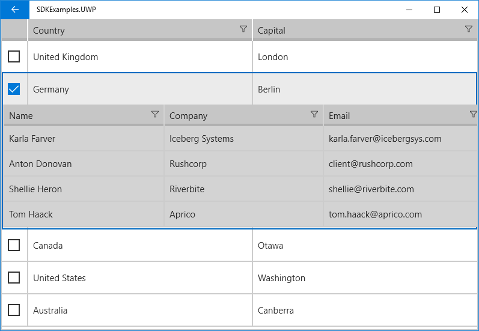

# Row Details

Each RadGridView row is capable of presenting additional information by means of a **Row Details**. The Row Details is a DataTemplate defined on the grid level and is used for displaying data without affecting the dimensions of the row and the cells within it.

In order to enable RowDetails feature you would need to set **RowDetailsDisplayMode** to "Single" and assign a specific **RowDetailsTemplate** to the DataGrid. The row and the row details share the same data context, so you are free to bind the elements in your template to any of the properties of the data item.

In addition, you should utilize RadDataGrid's ShowRowDetailsForItem and HideRowDetailsForItem methods for expanding/collapsing the RowDetails content. There is only one RowDetails displayed at a time, so opening a RowDetails panel automatically hides the previously displayed one (if any).

The next example demonstrates a scenario with DataGrid RowDetails content which could be expanded/collapsed by toggling a CheckBox inside a TemplateColumn.

First, let's use the following sample business objects:

	public class DataItem
	{
		public string Country { get; set; }
		public string Capital { get; set; }
		public ObservableCollection<Customer> Details { get; set; }
	}
	public class Customer
	{
		public string Name { get; set; }
		public string Company { get; set; }
		public string Email { get; set; }
	}

And set the ItemsSource of the DataGrid to a collection of DataItem objects:

	this.DataGrid.ItemsSource = new List<DataItem>
	{
		new DataItem { Country = "United Kingdom", Capital = "London"},
		new DataItem { Country = "Germany", Capital = "Berlin"},
		new DataItem { Country = "Canada", Capital = "Otawa"},
		new DataItem { Country = "United States", Capital = "Washington"},
		new DataItem { Country = "Australia", Capital = "Canberra"}
	};
	foreach (DataItem item in this.DataGrid.ItemsSource as List<DataItem>)
	{
		item.Details = new ObservableCollection<Customer>();
		item.Details.Add(new Customer() { Name = "Karla Farver", Company = "Iceberg Systems", Email = "karla.farver@icebergsys.com" });
		item.Details.Add(new Customer() { Name = "Anton Donovan", Company = "Rushcorp", Email = "client@rushcorp.com" });
		item.Details.Add(new Customer() { Name = "Shellie Heron", Company = "Riverbite", Email = "shellie@riverbite.com" });
		item.Details.Add(new Customer() { Name = "Tom Haack", Company = "Aprico", Email = "tom.haack@aprico.com" });
	}
	
Here is the DataGrid definition with the **RowDetailsTemplate** applied:

	<grid:RadDataGrid x:Name="DataGrid" 
					UserGroupMode="Disabled"
					AutoGenerateColumns="False"
					RowDetailsDisplayMode="Single"
					UserFilterMode="Enabled">
		<grid:RadDataGrid.RowDetailsTemplate>
			<DataTemplate>
				<grid:RadDataGrid ItemsSource="{Binding Details}"
								Background="LightGray"
								UserGroupMode="Disabled"
								UserEditMode="Inline"
								AutoGenerateColumns="False">
					<grid:RadDataGrid.Columns>
						<grid:DataGridTextColumn PropertyName="Name"/>
						<grid:DataGridTextColumn PropertyName="Company"/>
						<grid:DataGridTextColumn PropertyName="Email"/>
					</grid:RadDataGrid.Columns>
				</grid:RadDataGrid>
			</DataTemplate>
		</grid:RadDataGrid.RowDetailsTemplate>
		<grid:RadDataGrid.Columns>
			<grid:DataGridTemplateColumn SizeMode="Fixed" Width="40">
				<grid:DataGridTemplateColumn.CellContentTemplate>
					<DataTemplate>
						<CheckBox Checked="CheckBox_Checked" 
								Unchecked="CheckBox_Unchecked" 
								Margin="10"/>
					</DataTemplate>
				</grid:DataGridTemplateColumn.CellContentTemplate>
			</grid:DataGridTemplateColumn>
			<grid:DataGridTextColumn CanUserFilter="True" 
								PropertyName="Country"/>
			<grid:DataGridTextColumn CanUserFilter="True" 
								PropertyName="Capital"/>
		</grid:RadDataGrid.Columns>
	</grid:RadDataGrid>

Finally, add the needed CheckBox events for expanding/collapsing the RowDetails:

	private void CheckBox_Checked(object sender, RoutedEventArgs e)
	{
		this.DataGrid.ShowRowDetailsForItem((sender as CheckBox).DataContext);
	}
	private void CheckBox_Unchecked(object sender, RoutedEventArgs e)
	{
		this.DataGrid.HideRowDetailsForItem((sender as CheckBox).DataContext);
	}
	
Here is the final result:

