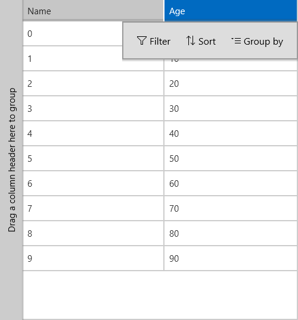

# Diplay Column Header Flyout

The following article shows an example of how to display column header flyout containing data commands, such as sorting, filtering and grouping.

To do that you would need to set *ColumnDataOperationsMode* property of RadDataGrid to Flyout.

	<telerikGrid:RadDataGrid ColumnDataOperationsMode="Flyout" />

Now, all data actions associated with grid columns will be moved into a separate flyout that can be triggered by header tap:

