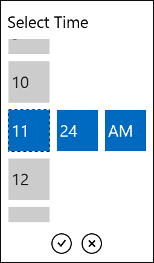

# Selector Properties

Here are listed the properties affecting the Date/Time Selector:

* **ItemLength** (double): Sets the length of the Date/Time Selector Items in pixels (all selector items have the same ItemLength).  

* **ItemSpacing** (double): Sets the space between the Date/Time Selector Items in pixels.  

* **ItemCount** (int): Sets the number of expanded boxes when selecting a component from the Date/Time Selector. For example, suppose that when you expand the component for month in the RadDatePicker you want to see four other choices.

		<telerik:RadDatePickerItemCount="4" />

	
* **SelectorOrder** (string): Sets the arrangement of the components in the Date/Time Selector and which of them to visualize. The value of this property should be a combination of the characters from the list below:
	* RadDatePicker available characters:
		* **y**: Visualizes the year item in the selection part.
		* **m**: Visualizes the month item in the selection part.
		* **d**: Visualizes the day item in the selection part.
	* RadTimePicker available characters:
		* **h**: Visualizes the hour item in the selection part.
		* **m**: Visualizes the minute item in the selection part.
		* **t**: Visualizes the time part item in the selection part.

	>You can set one, two or all the three components in the order you want them to appear.For example let's say you want to select only the time part and hour in this order in RadTimePicker.

		<telerik:RadTimePicker SelectorOrder="th"/>
	
	This is the expected result:  
	

* **SelectorDefaultValue** (DateTime?): Sets the default value of the Date/Time Selector in the Popup.
* **SelectorHeader** (object): Sets the header of the Popup.
* **SelectorHeaderTemplate** (DataTemplate): Sets your customized template for a Selector Header template.
* **IsOpen** (bool): If it is set to "true" the Popup is open by default. Its default value is "false".