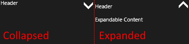

## Getting Started

This help article demonstrates how to utilize the **RadExpanderControl** shipped within the Telerik UI for {{ site.framework_name }} suite. First, you have to add a reference to the following assemblies:

* **Telerik.Code.dll**
* **Telerik.UI.Xaml.Primitives.dll**

Alternatively, you can add reference to **Telerik UI for {{ site.framework_name }} SDK**.

After references are ready you can proceed with the XAML declaration of the component:

	<telerik:RadExpanderControl Content="Header" ExpandableContent="Expandable Content"/>

Where the `telerik` namespace is defined like this:

	xmlns:telerik="using:Telerik.UI.Xaml.Controls.Primitives"

This code will be rendered on the targeted device like this

