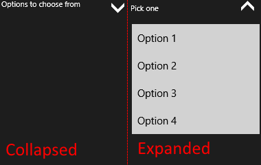

# Overview

**RadExpander** is a flexible control that represents a content control consisting of a main content presenter and an expandable content presenter that can be collapsed/expanded by the end users.

