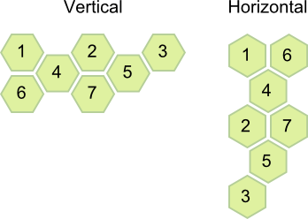

## Overview

> RadHexView is available for **Widndows 8.1**, **Widndows Phone 8.1** and **WUP**.

The **RadHexView** control is an items control that arranges [RadHexHubTile]() items in a honeycomb pattern.

## Getting Started

This help article shows how to create a RadListView from scratch using the RadListView related classes in the Telerik UI for Windows Universal. First, add a reference to the following assemblies:

* **Telerik.Core.dll**
* **Telerik.Data.dll**
* **Telerik.UI.Xaml.Primitives.dll**
* **Telerik.UI.Xaml.Controls.Data.dll**

Alternatively, you can add a reference to **Telerik UI for Windows Universal SDK**.

Now you can declare the RadHexView control:

	<telerikDataControls:RadHexView x:Name="listView" ItemsSource={Binding Data}/>

Where:

	xmlns:telerikDataControls="using:Telerik.UI.Xaml.Controls.Data"

## Properties and Configurations

### Properties:

* **BackContentPath** (string): Gets or sets the property name of the data model that will be used to set the BackContent of the items. 
* **ImageSourcePath** (string): Gets or sets the property name of the data model that will be used to set the ImageSource of the items.
* **TitlePath** (string): Gets or sets the property name of the data model that will be used to set the Title of the items. 
* **ItemsSource** (object): Gets or sets the items source.
* **ItemStyle** (Style): Gets or sets the style of the items. The Style should target the RadHexHubTile type.
* **ItemStyleSelector** (StyleSelector): Gets or sets a selector that is used when applying the style to an item.
* **LayoutDefinition** (HexLayoutDefinitionBase): Gets or sets the layout definition that specifies how the items will be arranged.
* **ScrollOffset** (double): Gets the current scroll offset.
* **MaxUpdateInterval** (TimeSpan): Gets or sets the maximum update interval of the tiles in the RadHexView.
* **MinUpdateInterval** (TimeSpan): Gets or sets the minimum update interval of the tiles in the RadHexView.
* **UpdateIntervalStep** (double): Gets or sets the step of the update interval values applied to the tiles in the RadHexView.

>The update interval of the items is set to a random value between the MinUpdateInterval and MaxUpdateInterval, considering the UpdateIntervalStep.

### Events:

* **ItemTap**: Occurs when an item within the control has been tapped.

## Layout Definitions

The layout definitions are used to specify the way the items are arranged.

### HexLayoutDefinitionBase

This is a base class for all layout definitions. Here are the available properties:

* **ItemLength** (double): Gets or sets the Length property of the items.
* **ItemsSpacing** (double): Gets or sets the spacing between the flat sides of the items.
* **Orientation** (Orientation): Gets or sets the orientation of the layout.
* **ViewPortExtension** (double): Gets or sets a value that specifies the amount of space added to the top and the bottom of the viewport, to be filled with items. The value is in relative units. For example: if you set it to 0.5, then half viewport will be added to the top and to the bottom of the visible area.

Here is an example of how to set LayoutDefinition:

	<telerikDataControls:RadHexView>
	    <telerikDataControls:RadHexView.LayoutDefinition>
	        <telerikHexView:FlatTightHexLayoutDefinition ItemLength="100" ItemsSpacing="4" ViewPortExtension="1"/>
	    </telerikDataControls:RadHexView.LayoutDefinition>
	</telerikDataControls:RadHexView>

Where:

	xmlns:telerikHexView="using:Telerik.UI.Xaml.Controls.Data.HexView"

The available definitions are:

* **AngledHexLayoutDefinition**:

* **FlatLooseHexLayoutDefinition**:  

* **FlatTightHexLayoutDefinition**:

