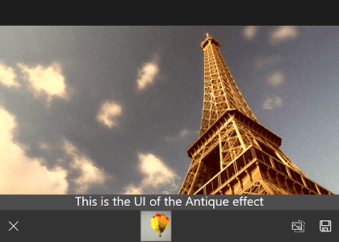
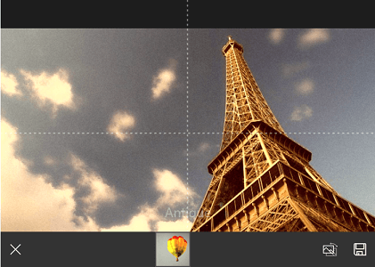

# Tools

RadImageEditor tools apply a specific effect to the image. Each tool can have immediate effect, or it cam be more complex and its settings can be controled with the tool UI or a tool layer. The RadImageEditor supports a large number of tools that are listed below.

## Tool Groups

The tools are organized in [tool groups](#basic-view). Each group has a **Name** and an **Icon** property and can contain a number of tools. There are three predefined tool groups:

- **ImageEditorBasicGroup**
 - BrightnessTool
 - ContrastTool
 - HueTool
 - SaturationTool
 - SharpnessTool
 - TemperatureTool
 - VibranceTool
- **ImageEditorEffectsGroup**
 - NoEffectTool
 - AntiqueTool
 - GrayscaleTool
 - LomoTool
 - MoonlightTool
 - NegativeTool
 - PosterizeTool
 - SepiaTool
- **ImageEditorTransformGroup**
 - RotateLeftTool
 - RotateRightTool
 - VerticalFlipTool
 - HorizontalFlipTool
 - CropTool

Here is an example: 

	<input:RadImageEditor>
	    <tools:ImageEditorBasicGroup/>
	    <tools:ImageEditorEffectsGroup/>
	    <tools:ImageEditorTransformGroup/>
	</input:RadImageEditor>

You can also define your own groups:

	<input:RadImageEditor>
	    <imageEditor:ImageEditorToolGroup Icon="ms-appx:///Icons/effects-tool.png" Name="Effects">
	        <tools:SepiaTool/>
	        <tools:GrayscaleTool/> 
	    </imageEditor:ImageEditorToolGroup>
	    <imageEditor:ImageEditorToolGroup Icon="ms-appx:///Icons/transform-tool.png" Name="Transform">
	        <tools:HorizontalFlipTool/>
	        <tools:VerticalFlipTool/>
	    </imageEditor:ImageEditorToolGroup>
	</input:RadImageEditor>

## Custom Tools

You can also create your own tools. Here are the abstract classes that could be used as a base for all image editor tools:

* **ImageEditorTool**: The most basic tool type.
* **RangeTool**: The effect of these tools can vary in the predefined range of values. The UI provides a way to specify the magnitude of the effect.
* **ImageEditorTransformTool**: Allows the user to physically transform the image with gestures.
* **ImageEditorEffectTool**: These tools do not support any configuration, they directly apply an effect by selecting the tool.

> There are some specifics in the application of the different types of tools. Generally, the tool effect is applied when another tool is selected. The effect tools are exception - if an effect is selected, any previously selected effect in the same tool group will be discarded.

## Customization

### Custom UI

Each tool can support custom UI that appears above the tools list. For example the UI of the range tools is a [slider](#toolsview). You can modify the UI with the **RadListView.ToolFactory** property.

Here is an example of how to add a custom UI to the AntiqueTool. You have to create a class that inherits from the **ImageEditorToolFactory** and override the **GetTemplate** method.

	public class CustomToolFactory : ImageEditorToolFactory
	{
	    public DataTemplate AntiqueTemplate { get; set; }
	
	    public override DataTemplate GetTemplate(ImageEditorTool tool)
	    {
	        if (tool != null && tool.Name == "Antique")
	        {
	            return this.AntiqueTemplate;
	        }
	
	        return base.GetTemplate(tool);
	    }
	}

Then you can set an instance of this class to the RadImageEditor.ToolFactory property.

	<input:RadImageEditor>
		<imageEditor:ImageEditorToolGroup Icon="ms-appx:///Images/effects-tool.png">
		    <tools:AntiqueTool/>
		</imageEditor:ImageEditorToolGroup>
		<input:RadImageEditor.ToolFactory>
		    <local:CustomToolFactory>
		        <local:CustomToolFactory.AntiqueTemplate>
		            <DataTemplate>
		                <TextBlock Text="This is the UI of the Antique effect" HorizontalAlignment="Center" VerticalAlignment="Center" FontSize="26" />
		            </DataTemplate>
		        </local:CustomToolFactory.AntiqueTemplate>
		    </local:CustomToolFactory>
		</input:RadImageEditor.ToolFactory>
	</input:RadImageEditor>

Here is the result:

### Custom Tool Layer

Some tools require a custom layer that is drawn on top of the image. For example the CropTool has a layer with a rectangle that specifies the crop area. You can add a custom layers with the **RadImageEditor.LayerSelector** property.

Here is an example of how to add a custom layer to the AntiqueTool.

Here is the custom layer that will be added on top of the image. It inherits from the **ImageEditorLayer** class.

	public class CustomLayer : ImageEditorLayer
	{
	    private FrameworkElement visual;
	    private Line hLine;
	    private Line vLine;
	
	    public CustomLayer()
	    {
	        var grid = new Grid();
	        var brush = new SolidColorBrush(Colors.White);
	
	        hLine = new Line { HorizontalAlignment = HorizontalAlignment.Stretch, Stroke = brush, StrokeThickness = 1, StrokeDashArray = new DoubleCollection { 4, 5 } };
	        vLine = new Line { VerticalAlignment = VerticalAlignment.Stretch, Stroke = brush, StrokeThickness = 1, StrokeDashArray = new DoubleCollection { 4, 5 } };
	
	        grid.Children.Add(hLine);
	        grid.Children.Add(vLine);
	
	        this.visual = grid;
	    }
	
	    protected override FrameworkElement VisualElement { get { return this.visual; } }
	
	    public override void ArrangeLayer(Telerik.Core.RadSize availableSize)
	    {
	        hLine.X2 = Owner.ActualWidth;
	        hLine.Y1 = hLine.Y2 = Owner.ActualHeight / 2;
	
	        vLine.X1 = vLine.X2 = Owner.ActualWidth / 2;
	        vLine.Y2 = Owner.ActualHeight;
	
	        base.ArrangeLayer(availableSize);
	    }	
	}

Then we have to create a layer selector class and override the **SelectLayer** method:

	public class LayerSelector : ImageEditorLayerSelector
	{
	    public override ImageEditorLayer SelectLayer(ImageEditorTool currentTool)
	    {
	        if (currentTool != null && currentTool.Name == "Antique")
	        {
	            return new CustomLayer();
	        }
	
	        return base.SelectLayer(currentTool);
	    }
	}

Finally, set the **RadImageEditor.LayerSelector** property to an instance of the created layer selector class:

	<input:RadImageEditor x:Name="imageEditor">
	    <imageEditor:ImageEditorToolGroup Icon="ms-appx:///Images/effects-tool.png">
	        <tools:AntiqueTool/>
	    </imageEditor:ImageEditorToolGroup>
	    <input:RadImageEditor.LayerSelector>
	        <local:LayerSelector />
	    </input:RadImageEditor.LayerSelector>
	</input:RadImageEditor>

Here is the result:

