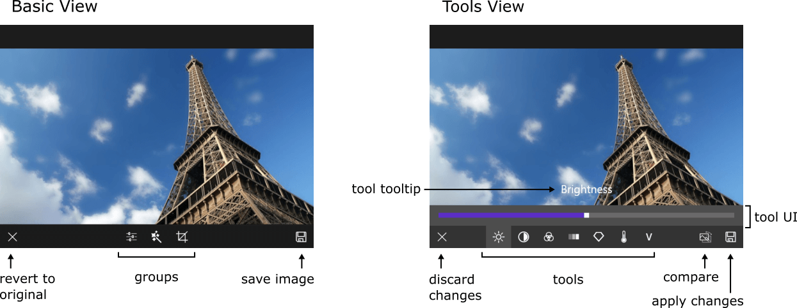

# Visual Structure

Here are described all the visual elements and terms used in a RadImageEditor control.

## Basic View

- **Revert to Original Button**: Reverts all changes applied to the image. 
- **Save Image Button**: Saves the image to disk.
- **Groups**: A collection of all groups. Each group contains a collection of tools.

## Tools View

- **Discard Changes Button**: Discards all changes that are made with the tools in the current group.
- **Apply Changes Button**: Applies the changes made with tools in the current group.
- **Compare Button**: Compares the current image with the state of the image before any changes applied with the tools in the current group. 
- **Tools**: A collection of all tools in the current group.
- **Tool UI**: The UI of the selected tool.
- **Tool Tooltip**: Shows information related to the current tool.
- **[Tool Layer] ()**

