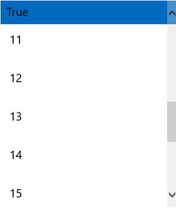
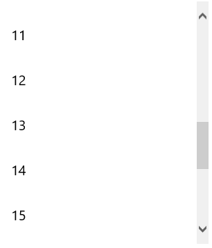

# Frozen Group Headers

The RadListView supports frozen group headers which can be turned off/on through the following property:

   **GroupHeaderDisplayMode** 

   - **Frozen** : The first group header stays static until the next group header takes its place while scrolling: 
   
       
   
   - **Scrollable**: All group headers respond to scrolling:

       