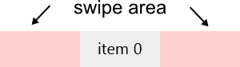
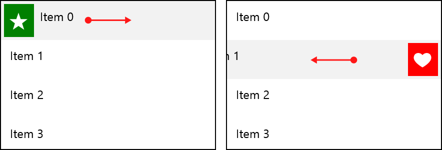
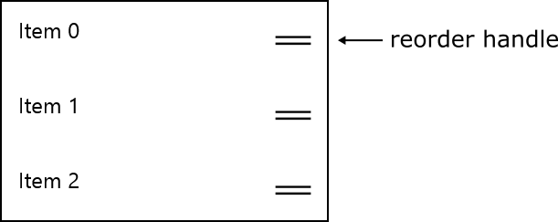

# Gestures

The RadListView control provides support for item drag gestures. Depending on how the user interacts with the control, two different behaviors are available:

- **Reordering**: There are two reorder modes:
	- With hold gesture: Enabled by first holding on an item until the reorder mode is triggered and then you are allowed to drag and drop the item at the desired position.
	- With reorder handle: Enabled by dragging the item reorder handle.
- **Swiping**: Swiping left or right over the **swipe area** displays the **SwipeActionContent**.  

## Swiping

The RadListViewcontrol exposes the following properties related to item swiping:

- **IsActionOnSwipeEnabled** (bool): Enables the item swiping.
- **SwipeActionContent** (object): Gets or sets the content below the swiped item.
- **ItemSwipeThreshold** (double): When an item is released after swipe, this threshold defines whether the item will remain swiped at the ItemSwipeOffset position or it will return to its normal state.
- **ItemSwipeOffset** (Thickness): Sets the offset of the item if the swiping is successful.

Example:

	<telerikData:RadListView ItemsSource="{Binding}" IsActionOnSwipeEnabled="True" SelectionMode="None" ItemSwipeOffset="50">
	    <telerikData:RadListView.SwipeActionContent>
	        <Grid>
	            <Grid.ColumnDefinitions>
	                <ColumnDefinition Width="50"/>
	                <ColumnDefinition Width="*"/>
	                <ColumnDefinition Width="50"/>
	            </Grid.ColumnDefinitions>
	            <Border Background="Green">
	                <TextBlock Text="&#xE0B4;" FontFamily="Segoe UI Symbol" HorizontalAlignment="Center" VerticalAlignment="Center" FontSize="30" Foreground="White"/>
	            </Border>
	            <Border Background="Red" Grid.Column="2">
	                <TextBlock Text="&#xE0A5;" FontFamily="Segoe UI Symbol" HorizontalAlignment="Center" VerticalAlignment="Center" FontSize="30" Foreground="White"/>
	            </Border>
	        </Grid>
	    </telerikData:RadListView.SwipeActionContent>
	</telerikData:RadListView>

## Reordering

- **IsItemReorderEnabled** (bool): Enables the reordering.
- **ReorderMode** (ListViewReorderMode): Gets or sets the reorder mode.
	- *Default*: The reordering starts with holding on the item. 
	- *Handle*: The reordering starts when the item is dragged using the reorder handle. The handle is visible only in this mode. 
 
Example:
	
	<telerikData:RadListView ItemsSource="{Binding}" ReorderMode="Handle" IsItemReorderEnabled="True"/>

## Commands

The RadListView control provides number of commands that are executed when a certain gesture occurs:

- **ItemDragStartingCommand**: Executed when the user starts dragging an item.  
  The command parameter is of type **ItemDragStartingContext** and provides the following properties:
	- **Item** (object): The interaction item.
	- **Action** (DragAction): Specifies whether the action is related to reordering or swiping. The available values are { *Reorder*, *ItemAction* }.
- **ItemActionTapCommand**: Executed when the SwipeActionButton is tapped.  
  The command parameter is of type **ItemActionTapContext** and provides the following properties:
	- **Item** (object): The interaction item.
	- **Offset** (double): The current offset of the item.
- **ItemSwipeActionCompleteCommand**: Executed when the swiping of the item has finished.  
  The command parameter is of type **ItemSwipeActionCompleteContext** and provides the following properties:
	- **Item** (object): The interaction item.
	- **FinalDragOffset** (double): The final drag offset that the item will be positioned.
	- **DragDelta** (double): The distance that the item has traveled.
- **ItemReorderCompleteCommand**: Executed when reordering of an item has finished.
  The command parameter is of type **ItemReorderCompleteContext** and provides the following properties:
	- **Item** (object): The interaction item.
	- **DestinationItem** (object): The destination item, where the item being reordered has been dropped.
- **ItemTapCommand**: Executed when an item has been tapped.
  The command parameter is of type **ItemTapContext** and provides the following property:
	- **Item** (object): The item that has been tapped.

>You can find more information about the RadListView commands [here]().

## Methods

- **EndItemDrag**(): Ends all drag currently running operations.

## How to Implement Reorder Functionality

Here is the XAML definition of the RadListView. The view model class should be defined as a static resource.
 
	<Page.Resources>
	    <local:ViewModel x:Key="viewModel"/>
	</Page.Resources>

	<telerikDataControls:RadListView DataContext="{StaticResource viewModel}" ItemsSource="{Binding Items}" IsItemReorderEnabled="True">
	     <telerikDataControls:RadListView.ItemTemplate>
	        <DataTemplate>
	            <TextBlock Text="{Binding Text}"/>
	        </DataTemplate>
	    </telerikDataControls:RadListView.ItemTemplate>
	    <telerikDataControls:RadListView.Commands>
	        <telerikListViewCommands:ListViewUserCommand Id="ItemReorderComplete" Command="{Binding ReorderItemsCommand, Source={StaticResource viewModel}}"/>
	    </telerikDataControls:RadListView.Commands>
	</telerikDataControls:RadListView>
		
Where:

    xmlns:telerikDataControls="using:Telerik.UI.Xaml.Controls.Data"
    xmlns:telerikListViewCommands="using:Telerik.UI.Xaml.Controls.Data.ListView.Commands"

Here are the view model and data classes:

	public class ViewModel
	{
	    public ViewModel()
	    {
	        this.Items = GetItems();
	        this.ReorderItemsCommand = new DelegateCommand(ReorderItems);
	    }
	
	    public ICommand ReorderItemsCommand { get; set; }
	
	    public ObservableCollection<Item> Items { get; set; }
	
	    private ObservableCollection<Item> GetItems()
	    {
	        var items = new ObservableCollection<Item>();
	        for (var i = 0; i < 3; i++)
	        {
	            items.Add(new Item { Text = "item " + i });
	        }
	
	        return items;
	    }
	
	    private void ReorderItems(object parameter)
	    {
	        var context = parameter as ItemDragCompleteContext;
	
            var item = context.Item as Item;
            var destItem = context.DestinationItem as Item;
	
            int sourceIndex = this.Items.IndexOf(item);
            int targetIndex = this.Items.IndexOf(destItem);

            this.Items.Move(sourceIndex, targetIndex);
	        }
	    }
	}

	public class Item
	{
	    public string Text { get; set; }
	}

Finally, here is a sample implementation of DelegateCommand:

	public class DelegateCommand : ICommand
    {
        private readonly Predicate<object> canExecute;
        private readonly Action<object> action;

        public event EventHandler CanExecuteChanged;

        public DelegateCommand(Action<object> execute): this(execute, null)
        {
        }

        public DelegateCommand(Action<object> execute, Predicate<object> canExecute)
        {
            this.action = execute;
            this.canExecute = canExecute;
        }

        public bool CanExecute(object parameter)
        {
            if (canExecute == null)
            {
                return true;
            }

            return canExecute(parameter);
        }

        public void Execute(object parameter)
        {
            action(parameter);
        }

        public void RaiseCanExecuteChanged()
        {
            if (CanExecuteChanged != null)
            {
                CanExecuteChanged(this, EventArgs.Empty);
            }
        }
    }