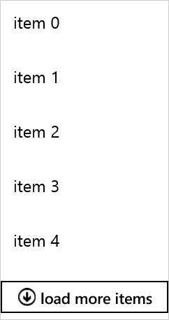

# Incremental Loading

This topic describes how to enable incremental data loading in RadListView.

To enable incremental loading, you have to use as ItemsSource a collection that implements the **ISupportIncrementalLoading** interface. You can also take advantage of the **IncrementalLoadingCollection** which is our default implementation.

The **IncrementalLoadingMode** property specifies how new items are requested. Two loading modes are supported:

- **Automatic**: Scrolling to the end of the control automatically loads more items.
- **Explicit**: The user has to explicitly request more items by click/tap on the button.  

The RadListView also supports LoadMoreDataCommand that by default is executed to load new data. You can find more information about the list view commands [here]().

## Using IncrementalLoading Collection

This example demonstrates how to use the incremental loading functionality. Please note that the approach works for both Automatic and Explicit loading modes.

Here is the RadListView XAML declaration:
	
	<telerikDataControls:RadListView x:Name="listView" IncrementalLoadingMode="Explicit" ItemsSource="{Binding Items}">
		<telerikDataControls:RadListView.DataContext>
    		<local:ViewModel/>
		</telerikDataControls:RadListView.DataContext>
	    <telerikDataControls:RadListView.ItemTemplate>
	        <DataTemplate>
	            <TextBlock Text="{Binding Text}"/>
	        </DataTemplate>
	    </telerikDataControls:RadListView.ItemTemplate>
	</telerikDataControls:RadListView>

Where:

	xmlns:telerikDataControls="using:Telerik.UI.Xaml.Controls.Data"

This is the view model class:

 	public class ViewModel
    {
        private int currentCount = 0;

        public ViewModel()
        {
            this.Items = new IncrementalLoadingCollection<Item>(this.GetMoreItems) { BatchSize = 5 };
        }

        public IncrementalLoadingCollection<Item> Items { get; set; }

        private async Task<IEnumerable<Item>> GetMoreItems(uint count)
        {
            await Task.Delay(1000);
            var result = Enumerable.Range(this.currentCount, (int)count).Select(x => new Item { Text = "item " + x }).ToList();
            currentCount += (int)count;
            return result;
        }	
    }

	public class Item 
    {
        public string Text { get; set; }
    }

Here is the result:

## Using LoadMoreDataCommand

This example demonstrates how you can utilize LoadMoreDataCommand to load items - the approach works for both Automatic and Explicit loading modes.

Here is the RadListView XAML declaration:

	<telerikDataControls:RadListView x:Name="ListView" ItemsSource="{Binding Items}" />

This is the view model class:

	public class ViewModel
	{
		public ViewModel()
		{
			this.Items = new ObservableCollection<int>();
			this.AddItems(40);
		}

		public ObservableCollection<int> Items { get; }

		public void AddItems(int count)
		{
			for (int i = 0; i < count; i++)
			{
				this.Items.Add(this.Items.Count);
			}
		}
	}
	
Here is the LoadMoreDataCommand implementation:

	public class CustomLoadOnDemandCommand : LoadMoreDataCommand
	{
		private int lodCounter;

		public CustomLoadOnDemandCommand()
			:base()
		{
			this.Id = CommandId.LoadMoreData;
		}

		public override bool CanExecute(object parameter)
		{
			LoadMoreDataContext context = (LoadMoreDataContext)parameter;
			LoadOnDemandCommand.ViewModel viewModel = (LoadOnDemandCommand.ViewModel)context.DataContext;

			bool canExecute = viewModel.Items.Count < 100;
			return canExecute;
		}

		public async override void Execute(object parameter)
		{
			base.Execute(parameter);

			LoadMoreDataContext context = (LoadMoreDataContext)parameter;
			LoadOnDemandCommand.ViewModel viewModel = (LoadOnDemandCommand.ViewModel)context.DataContext;
			this.lodCounter++;

			if (this.lodCounter % 3 == 0)
			{
				// If we do not need to get new data asynchronously, we can add the new items right away.
				viewModel.AddItems(15);
			}
			else
			{
				// If we need to get new data asynchronously, we must manually update the loading status.

				this.Owner.ChangeDataLoadingStatus(BatchLoadingStatus.ItemsRequested);

				// Mimic getting data from server asynchronously.
				await Task.Delay(2000);

				viewModel.AddItems(15);

				this.Owner.ChangeDataLoadingStatus(BatchLoadingStatus.ItemsLoaded);
			}
		}
	}
		
Lastly, add the defined above command to the ListView Commands collection:

	this.ListView.Commands.Add(new CustomLoadOnDemandCommand());

	this.DataContext = new ViewModel();
	

