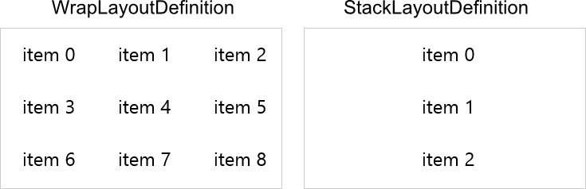

# Layouts

The RadListView supports two different layouts - wrap and stack. The layout could be modified with the following properties:

- **LayoutDefinition**: Takes values of type LayoutDefinitionBase, which is base class for the following classes:
 - **WrapLayoutDefinition** { ItemWidth }
 - **StackLayoutDefinition**
- **Orientation**: Each layout supports horizontal and vertical orientation.

> Currently the **WrapLayoutDefinition** supports only items with equal width.

Here is an example:

	<telerikDataControls:RadListView>
	    <telerikDataControls:RadListView.LayoutDefinition>
	        <telerikListView:WrapLayoutDefinition ItemWidth="50"/>
	    </telerikDataControls:RadListView.LayoutDefinition>
	</telerikDataControls:RadListView>
