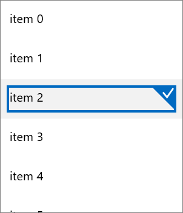
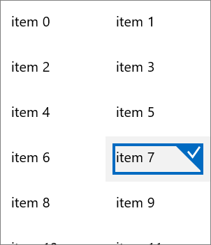
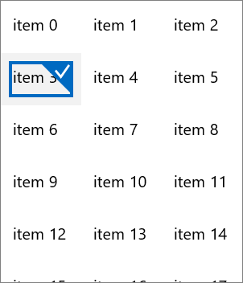
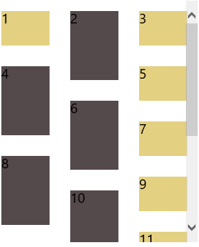

# Layouts

The RadListView supports different layouts. The layout could be modified with the following properties:

- **Orientation**: Each layout supports horizontal and vertical orientation.
- **LayoutDefinition**: Takes values of type LayoutDefinitionBase, which is base for the following classes:
 - **StackLayoutDefinition**: A layout definition that arranges the items in a stack.

		     <telerikDataControls:RadListView>
		         <telerikDataControls:RadListView.LayoutDefinition>
		             <telerikListView:StackLayoutDefinition/>
		         </telerikDataControls:RadListView.LayoutDefinition>
		     </telerikDataControls:RadListView>
		  
 - **GridLayoutDefinition**: A layout definition that arranges the items in a grid. It has the following property:  
   **SpanCount** (int): Gets or sets the span count of the grid.

	        <telerikDataControls:RadListView>
	            <telerikDataControls:RadListView.LayoutDefinition>
	                <telerikListView:GridLayoutDefinition SpanCount="2"/>
	            </telerikDataControls:RadListView.LayoutDefinition>
	        </telerikDataControls:RadListView>
            
 - **WrapLayoutDefinition**:  A layout definition that wraps the items. Currently  only items with equal width are supported. It has the following property:  
    **ItemWidth** (int): Gets or sets the width of the items.

			<telerikDataControls:RadListView ItemsSource="{Binding}" Height="350" Width="300" >
			    <telerikDataControls:RadListView.LayoutDefinition>
			        <telerikListView:WrapLayoutDefinition ItemWidth="100"/>
			    </telerikDataControls:RadListView.LayoutDefinition>
			</telerikDataControls:RadListView>
            

 - **StaggeredLayoutDefinition**: A layout definition that arranges variable sized items in columns. It has the following property:  
   **SpanCount** (int): Gets or sets the column count of the layout.

			<telerikDataControls:RadListView ItemsSource="{Binding}" Height="350" Width="300" >
			    <telerikDataControls:RadListView.LayoutDefinition>
			        <telerikListView:StaggeredLayoutDefinition SpanCount="3" />
			    </telerikDataControls:RadListView.LayoutDefinition>
			</telerikDataControls:RadListView>
           