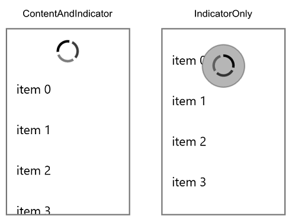

# Pull to Refresh

## Properties

* **IsPullToRefreshEnabled** (bool): Gets or sets a value indicating whether the pull to refresh is enabled.
* **PullToRefreshScrollMode** (PullToRefreshScrollMode): Gets or sets the scroll mode of pull to refresh indicator. Two modes are available:

* **IsPullToRefreshActive** (bool): Gets or sets a value indicating whether the is pull to refresh active.

## Events

* **RefreshRequested**: Occurs when Pull to refresh is initiated.