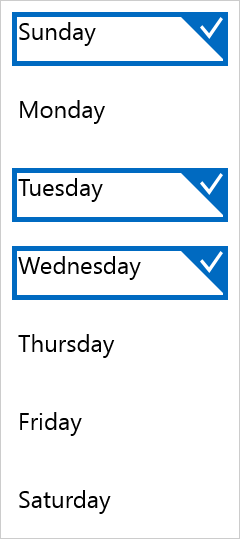

# Selection

Within a RadListView control, selection can be made by a click/tap on a list view item, which raises the **SelectionChanged** event.

>You can directly listen to the **CollectionChanged** event of the **SelectedItems** property.

You can deselect an item if it is already selected by a click/tap on it.

## Properties

- **SelectionMode**: Switches between the different selection modes. It takes the following values (of type DataControlsSelectionMode):
 - **Single**: Single item can be selected (default).
 - **Multiple**: Multiple items can be selected.
 - **None**: No selection is allowed.
  
Once you make a selection, you can get or modify a collection with the selected items by using:

- **SelectedItem**: An item that is currently selected.
- **SelectedItems** (ObservableCollection&lt;object&gt;): Gets the currently selected items.

## Methods

The RadListView exposes the following methods that allow programmatic modification of the selected items.

- **SelectItem**(object *item*): Selects the specified data item and adds it in the SelectedItems collection.
- **DeselectItem**(object *item*): Removes the selection for the specified data item and removes it from the SelectedItems collection.
- **SelectAll**(): If multiple selection is allowed, this method selects all items in the list view.
- **DeselectAll**(): Clears the currently selected items.

## Commands

When the user taps on an item the ItemTapCommand is executed. You can find more information about the RadListView commands [here]().

## Example

	xmlns:telerikDataControls="using:Telerik.UI.Xaml.Controls.Data"

    <telerikDataControls:RadListView x:Name="listView" Width="200" SelectionMode="Multiple"/>

 	listView.ItemsSource = Enum.GetNames(typeof(DayOfWeek)).ToList();
	listView.SelectItem("Sunday");
	listView.SelectItem("Tuesday");
	listView.SelectItem("Wednesday");

