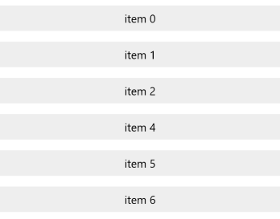

# Styling

RadListView control exposes the following properties that can help you customize the appearance of its elements:

- **ItemTemplate**
- **ItemTemplateSelector**
- **ItemStyle**
- **ItemStyleSelector**
- **GroupHeaderTemplate**
- **GroupHeaderTemplateSelector**
- **GroupHeaderStyle**
- **GroupHeaderStyleSelector**

## Item Actions Customization

This example will demonstrate how to to customize the RadListView items:

	<telerikDataControls:RadListView IsActionOnSwipeEnabled="True" x:Name="listView">
		<telerikDataControls:RadListView.ItemStyle>
			
		</telerikDataControls:RadListView.ItemStyle>
		<telerikDataControls:RadListView.ItemTemplate>
			<DataTemplate>
				<TextBlock Text="{Binding}" VerticalAlignment="Center" HorizontalAlignment="Center"/>
			</DataTemplate>
		</telerikDataControls:RadListView.ItemTemplate>
	</telerikDataControls:RadListView>

	listView.ItemsSource = new List<string> { "item 0", "item 1", "item 2", "item 4", "item 5", "item 6" };

Here is the result:

