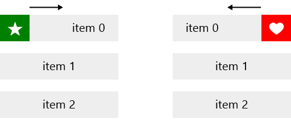

# Styling

The RadListView control exposes the following properties that can help you customize the appearance of its elements:

- **ItemTemplate**
- **ItemTemplateSelector**
- **ItemStyle**
- **ItemStyleSelector**
- **GroupHeaderTemplate**
- **GroupHeaderTemplateSelector**
- **GroupHeaderStyle**
- **GroupHeaderStyleSelector**

## Action Buttons

	<telerikDataControls:RadListView IsActionOnSwipeEnabled="True">
	    <telerikDataControls:RadListView.ItemStyle>
	        
	    </telerikDataControls:RadListView.ItemStyle>
	    <telerikDataControls:RadListView.FirstActionContent>
	        <Grid  Width="50" Margin="-5,0,-5,0">
	            <Rectangle Fill="Green"/>
	            <TextBlock Text="&#xE0B4;" Foreground="White" FontFamily="Segoe UI Symbol" VerticalAlignment="Center" FontSize="25" HorizontalAlignment="Center"/>
	        </Grid>
	    </telerikDataControls:RadListView.FirstActionContent>
	    <telerikDataControls:RadListView.SecondActionContent>
	        <Grid  Width="50" Margin="-5,0,-5,0">
	            <Rectangle Fill="Red"/>
	            <TextBlock Text="&#xE0A5;" Foreground="White" FontFamily="Segoe UI Symbol" VerticalAlignment="Center" FontSize="25" HorizontalAlignment="Center"/>
	        </Grid>
	    </telerikDataControls:RadListView.SecondActionContent>
	    <telerikDataControls:RadListView.ItemTemplate>
	        <DataTemplate>
	            <TextBlock Text="{Binding Text}" VerticalAlignment="Center" HorizontalAlignment="Center"/>
	        </DataTemplate>
	    </telerikDataControls:RadListView.ItemTemplate>
	</telerikDataControls:RadListView>

Here is the result:

