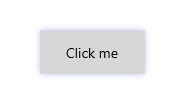
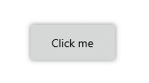
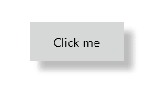
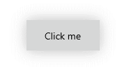

# Key Features

The purpose of this help article is to show you the key features of the **RadShadow** control. 

## Setting Shadow Color

Through the **Color** property you can paint the shadow that wraps around your views – you can make it consistent with the colors of the surrounded controls, or you can just use a softer color to make the shadow look more natural.

Here is a quick example of a colored shadow around Button: 

	<telerikPrimitives:RadShadow x:Name="shadow"                              
								Color="Blue">
		<Button Content="Click me" 
				Background="#D6D7D7"
				Height="44"
				Padding="24, 0"/>
	</telerikPrimitives:RadShadow>

Check the result below:

## Defining Transparency

Through **ShadowOpacity** you can control the color transparency level of the RadShadow. The defined value should be between 0 and 1, by default ShadowOpacity is set to 0.26.

	<telerikPrimitives:RadShadow x:Name="shadow"                              
								 ShadowOpacity="0.5">
		<Button Content="Click me" 
				Background="#D6D7D7"
				Height="44"
				Padding="24, 0"/>
	</telerikPrimitives:RadShadow>

And how it looks:

## Defining Shadow Position

RadShadow exposes **OffsetX** and **OffsetY** properties used to specify the shadow’s position relative to the position of the view that is casting it. Positive x/y offsets will shift the shadow to the right and down, while negative offsets shift the shadow to the left and up.
  
By default, **OffsetX** and **OffsetY** are set to 0.00, so that the shadow appears on all sides of the View it surrounds. 

	<telerikPrimitives:RadShadow x:Name="shadow"                              
								 OffsetX="10"
								 OffsetY="10">
		<Button Content="Click me" 
				Background="#D6D7D7"
				Height="44"
				Padding="24, 0"/>
	</telerikPrimitives:RadShadow>

Check the result below:

## Applying Corner Radius 

The **ShadowCornerRadius** property represents the degree to which the corners of the Shadow are rounded - this is useful in cases RadShadow wraps around a view with rounded edges. 

Check below a quick example with RadButton with CornerRadius applied: 

	<telerikPrimitives:RadShadow x:Name="shadow"                              
								ShadowCornerRadius="15">
		<Button Content="Click me" 
				Background="#D6D7D7"
				Height="44"
				Padding="24, 0"
				CornerRadius="15"/>
	</telerikPrimitives:RadShadow>

In this way the shadow looks consistent with the rounded button:

## Applying Blur Radius

Through the **BlurRadius** property you can specify the shadow blur-level  - the higher the number, the more blurred it will be, and the further out the shadow will extend. 

By default, the **BlurRadius** is 10.

	<telerikPrimitives:RadShadow x:Name="shadow"                              
								BlurRadius="30">
		<Button Content="Click me" 
				Background="#D6D7D7"
				Height="44"
				Padding="24, 0"/>
	</telerikPrimitives:RadShadow>

 

## See Also

- [Getting Started]()