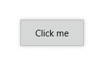

# Getting Started

This help article shows how to create a RadShadow from scratch.

First, add a reference to the needed assemblies:
        
* **Telerik.Core.dll**
* **Telerik.UI.Xaml.Primitives.dll**

Alternatively, you can add a reference to **Telerik UI for {{ site.framework_name }} SDK**.

Next, add the **Telerik.UI.Xaml.Controls.Primitives** namespace:

	xmlns:telerikPrimitives="using:Telerik.UI.Xaml.Controls.Primitives"

Declare the RadShadow that is in the Telerik.UI.Xaml.Controls.Primitives namespace. For the purpose of the example, Shadow wraps around a Button control:

	<telerikPrimitives:RadShadow x:Name="shadow">
		<Button Content="Click me" 
				Background="#D6D7D7"
				BorderBrush="#B5B6B8"
				BorderThickness="1"
				Height="44"
				Padding="24, 0"/>
	</telerikPrimitives:RadShadow>

