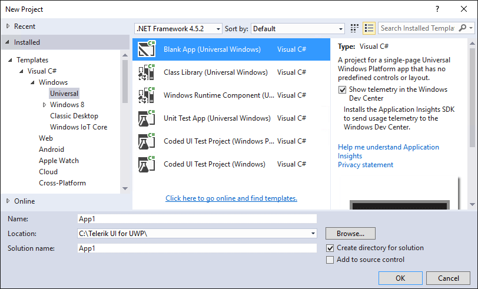
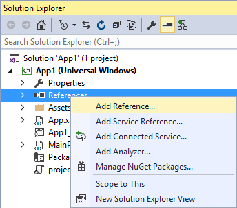
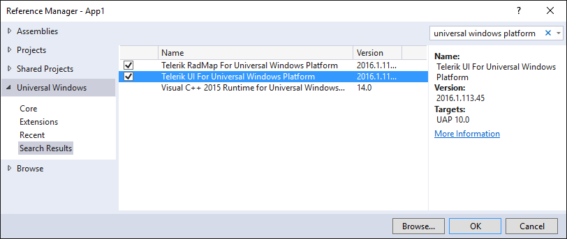

# Start Using Telerik UI for UWP

The following example describes what steps you should perform in order to add Telerik UI for UWP in your application.

## Requirements
Before walking through this example, you must have installed **Telerik UI for UWP** and **Visual Studio 2015** on your machine.

## Steps

#### Remove all old versions

Before creating any project customers firs need to manually remove all previous versions of the **Telerik UI for UWP** suite of controls. This step is mandatory to ensure that everything and only what is needed is installed. To do this customers should uninstall the visual studio extensions. This can be done through the Visual Studio's Extensions and Updates wizard.

Next step is to uninstall the Telerik extensions.

If there are no results after searching any telerik extensions customers are ready to install the latest version of Telerik UI for UWP suite.

#### Install Telerik UI for UWP suite

Customers need to download from their Telerik account the latest official release of the Telerik UI for UWP suite available. After unzipping the downloaded file customers should be able to find three Visual Studio extension installers. They are placed under the **\Binaries\VSIX** folder. 

First should be installed the **VISX.UWP.vsix** extension since the other two depend on it. Next customers should install the other two extensions (installation order does not matter).

#### Create application

Once the extensions are installed customers are ready to continue with creating their application. Visual Studio 2015 provides Blank App template which can be used for easier start. It can be created by the New Project wizard.

#### Add required references

Once the wizard finishes creating the Blank App customers are ready to reference the already installed packages. 

In the Reference Manager all the extensions should be visible. Customers can reference the necessary one(s).

