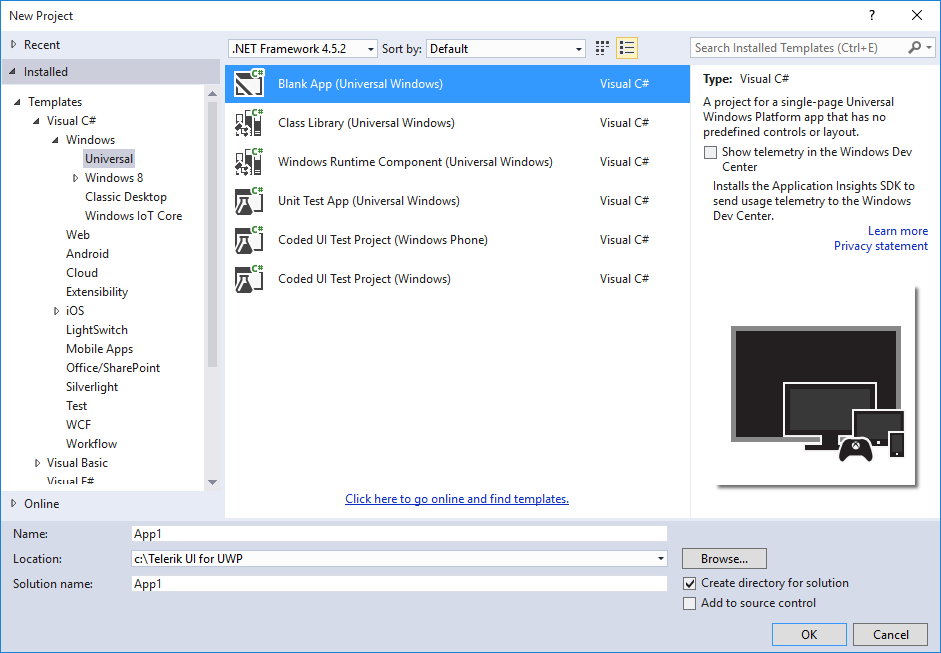
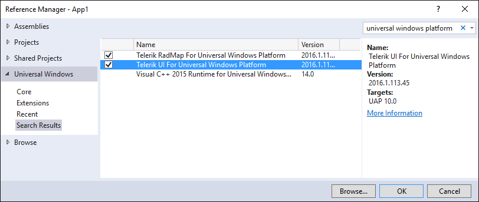

# Start Using Telerik UI for UWP

The following example describes what steps you should perform in order to add Telerik UI for UWP in your application.

## Requirements
Before walking through this example, you must have installed **Telerik UI for UWP** and **Visual Studio 2015** on your machine.

## Create Application

Once the extensions are installed customers are ready to continue with creating their application. Visual Studio 2015 provides Blank App template which can be used for easier start. It can be created using the New Project wizard.

### Add required references

Once the wizard finishes creating the Blank App customers are ready to reference the already installed packages. 

In the Reference Manager all the extensions should be visible. Customers can reference the necessary one(s).

Referencing all three packages equals to referencing all binaries in the suite. This means customers will be allowed to utilize every single component from the suite. 

However, if this is not convenient and optimization is required customers are capable of manually referencing only the binaries they need. In the cases when only one or two of the available controls are used this optimization may be considered. The required binaries are described in each control's **Getting Started** article. It may turn out that the application needs only two of the available assemblies. In this case instead of referencing everything the better approach would be to include only the needed ones.