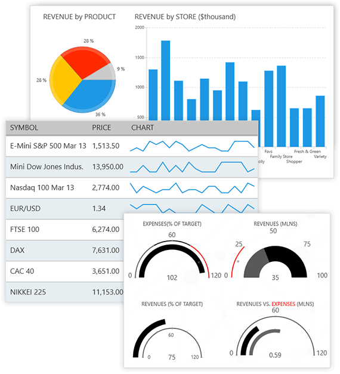

# Introduction

Thank you for choosing **Telerik UI for Universal Windows Platform!**

Telerik UI for Universal Windows Platform is built to target Universal Windows Platform application development and deliver a unique experience based on the [Microsoft UX guidelines for Windows Runtime apps](http://msdn.microsoft.com/en-us/library/windows/apps/hh465424.aspx).  

To read more about the benefits of using Telerik UI for UWP, please visit the [product overview page](https://www.telerik.com/universal-windows-platform-ui).

 
<a href="https://www.telerik.com/download-trial-file/v2-b/ui-for-universal-windows-platform" class="uwp_download_btn js-btnWin" style="display: none">Download Free Trial</a>

## Telerik UI for UWP Controls

Our suite features the following controls for UWP platform development:

* [RadAutoCompleteBox]()
* [RadBulletGraph]() 
* [RadBusyIndicator]() 
* [RadCalendar]() 
* [RadChart]() 
* [RadDataBoundListBox]() 
* [RadDataForm]()
* [RadDataGrid]() 
* [RadDatePicker and RadTimePicker]() 
* [RadExpander]() 
* [RadGauge]() 
* [RadHubTile]() 
* [RadListView]() 
* [RadLoopingList]() 
* [RadMap]() 
* [RadNumericBox]() 
* [RadPagination]() 
* [RadRadialMenu]() 
* [RadRangeSlider]() 
* [RadRating]()
* [RadSideDrawer]()

## Getting Started with Telerik UI for UWP

To learn how to install and work with Telerik UI for UWP suite, visit the following resources:

* [System Requirements]()
* [Installation Steps]()
* [Getting Started with UWP]()

## Trial Version and Commercial License

Telerik UI for UWP has an open source version which can be downloaded from the [GitHub](https://github.com/telerik/UI-For-UWP). Commercial support is available at our [product page](https://www.telerik.com/universal-windows-platform-ui) where you'll find a supported commercial trial and pricing options.

## Support Options

For any issues you might encounter while working with UI for UWP, use any of the available support channels:

- UI for UWP license holders and active trialists can take advantage of the outstanding customer support delivered by the developers building the library. To submit a support ticket, use our [support system](https://www.telerik.com/account/support-tickets/my-support-tickets.aspx).
- [UI for UWP forum](https://www.telerik.com/forums/ui-for-universal-windows-platform) is part of the free support you can get from the community and from the UI for UWP team on all kinds of general issues.
- [UI for UWP feedback portal](https://feedback.telerik.com/uwp) provides information on the features in discussion and also the planned ones for release.
- [UI for UWP GitHub issue list](https://github.com/telerik/UI-For-UWP/issues) can be used for bug reports.
- You may still need a tailor-made solution for your project. In such cases, go straight to [Progress Services](https://www.progress.com/services).
     
## Related Links

- Telerik UI for UWP product page - https://www.telerik.com/universal-windows-platform-ui

- Latest news for Telerik UI for UWP - https://www.telerik.com/support/whats-new/uwp

## Help us Improve the Telerik UI for Universal Windows Platform Documentation

We believe that the documentation for a product is at its best when the content is a collaboration between the builders and consumers of that product. Everybody can play a role in making our documentation better and we encourage you to help us with that task in the way that you choose:

__Submit a New Issue at GitHub__

If you find an issue with our docs that need to be addressed, the best way to let us know is by creating an issue in our [Github repository](https://github.com/telerik/uwp-docs/issues/new). When creating an issue, please provide a descriptive title, be as specific as possible and link to the documentation in question. If you can provide a link to the closes anchor to the issue, that is even better.

__Update the Documentation at GitHub__

Creating an issue is great, but what we really love are pull requests. This is the most direct method.  So, if you find an issue in the docs, or even feel like creating new content, we’d be happy to have your contributions! The basic steps are that you fork our documentation and submit a pull request. That way you may contribute to exactly where you found the error.  After that, our technical writing team just needs to approve your change request. Please use only standard markdown. For a more detailed instructions, please follow [the contribution instructions](https://github.com/telerik/uwp-docs/blob/master/README.md) published in GitHub.

Thank you for your contribution to the Telerik UI for Xamarin Documentation!
